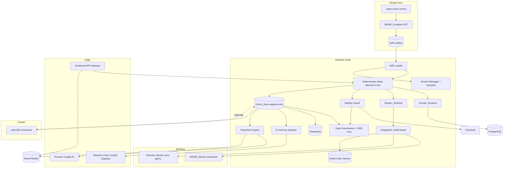

# Design Document

## Overview

**BPMP Platform** là nền tảng BPM hướng sự kiện, AI-native, có deterministic core viết bằng Rust và deployable service ngoại vi dùng Rust/Go theo bounded context. Nền tảng kết hợp trải nghiệm BA-first của Camunda với năng lực thực thi bền vững của Temporal. Thiết kế xoay quanh bốn trụ cột:

1. **BPMN-as-IR (AOT Compiler):** Biên dịch trước `.bpmn/.dmn/.cmmn` thành **WIR** (Workflow Intermediate Representation) — state machine Rust được kiểm chứng type-safe tại compile-time, loại bỏ hoàn toàn việc parse XML lúc runtime.
2. **Dual Runtime trên cùng một WIR:** `Human_Runtime` (governance, PostgreSQL, P95 ≤500ms) và `Stream_Runtime` (throughput, event log, decision-to-dispatch <10ms).
3. **Event Sourcing core:** append-only immutable log + snapshot, cho phép deterministic replay, time-travel, hot-fix.
4. **Hybrid Worker Model + AI:** WASM in-process (wasmtime) và remote gRPC (tonic) với credit-based backpressure; lớp Process Copilot khai thác telemetry/event log.

### Nguyên tắc thiết kế (bám sát steering rules)

- **Non-blocking:** Rust service dùng `tokio`; Go service dùng `context` + non-blocking network I/O/goroutine có bounded concurrency. Không có blocking call trên engine coordination thread.
- **Fault-tolerant:** timeout, retry (backoff), circuit breaker, bulkhead, dead-letter queue là first-class.
- **Deterministic core:** lõi state machine thuần (pure), tách biệt side-effect ra worker layer để đảm bảo replay xác định.
- **Bounded resources:** streaming/chunking, bounded queue, backpressure để tránh memory blow-up.
- **Security-first:** mọi transition được xác thực claim/role tại lõi graph trước khi áp dụng; dữ liệu được scope theo tenant và mã hóa khi truyền/lưu trữ.
- **Configurable-by-default:** policy nghiệp vụ và tham số vận hành phải đến từ Configuration_Profile versioned, có scope và audit; domain core chỉ nhận snapshot cấu hình như input, không đọc trực tiếp database/file/env/runtime config.

### Lựa chọn công nghệ (research findings)

| Mối quan tâm | Lựa chọn | Lý do |
|---|---|---|
| Async runtime | `tokio` | Chuẩn de-facto cho async Rust, hỗ trợ streaming, timer, backpressure. |
| RPC/streaming | `tonic` (gRPC) | Bidirectional streaming, phù hợp credit-based flow control. |
| WASM sandbox | `wasmtime` | Hỗ trợ fuel metering (CPU) và memory limits (Store limiter) → trap được vòng lặp vô hạn mà không sập host. |
| Event store | `RocksDB` production; `redb` chỉ là optional single-node profile sau benchmark | RocksDB có column family và operational history phù hợp stateful event store; loại `sled` vì beta/on-disk migration risk. |
| Consensus/HA | `openraft` | Raft library thuần Rust, hỗ trợ log replication + membership. |
| Relational (Human) | PostgreSQL qua `pgx/v5` trong Go Human Runtime | Connection pooling, PostgreSQL-native types, optimistic locking qua cột version. |
| Push realtime | SSE/WebSocket trong Go Cockpit Gateway | Goroutine + bounded outbound queue, scale theo long-lived connection. |
| Contracts/WIR | Protocol Buffers + Buf; Rust dùng `prost`, Go dùng generated protobuf | Durable/versioned, có breaking-change check, không phụ thuộc Rust memory layout hoặc `bincode`. |
| BPMN XML parse (compile-time) | `quick-xml` | Streaming parser, chỉ dùng trong compiler, không ở runtime. |
| Dynamic configuration | Versioned Configuration_Profile trên PostgreSQL/object storage/GitOps-backed store theo bounded context | Cấu hình có schema, scope, audit, rollback; không dùng hardcode cho policy, quota, timeout, retry, SLA hoặc routing. |
| Observability | Rust `tracing`/OpenTelemetry; Go OpenTelemetry SDK; OTLP Collector | Structured logging, distributed tracing, metrics xuyên ngôn ngữ. |

> Baseline version, deployable boundaries và project layout được chốt trong [microservices-architecture.md](microservices-architecture.md). Production ưu tiên supported/LTS release và pinned lockfile, không tự động chạy theo newest release.

## Architecture

### Logical view và deployment view

Sơ đồ dưới đây là logical component view, không ánh xạ mỗi box thành một microservice. Deployment view dùng các bounded context `bpmp-engine`, `human-runtime`, `api-gateway`, `projection-service`, `governance-service`, `cockpit-gateway` và `process-copilot` như mô tả trong [microservices-architecture.md](microservices-architecture.md). `domain-core`, WIR interpreter, `decide()` và `evolve()` chỉ tồn tại trong Rust `bpmp-engine`; service Go chỉ gọi versioned gRPC contract hoặc consume committed event.

### Sơ đồ thành phần tổng thể



### Luồng thực thi cốt lõi (command → event)

```mermaid
sequenceDiagram
    participant Client
    participant API as Versioned API
    participant SEC as Identity Guard
    participant IDEMP as Idempotency Store
    participant CORE as SM Core (pure)
    participant ES as Event_Store
    participant PS as pub/sub
    participant CK as Cockpit

    Client->>API: Command + JWT (Idempotency-Key)
    API->>API: Validate DTO, rate-limit
    API->>SEC: Verify claims/roles for transition
    alt token invalid / thiếu quyền
        SEC-->>Client: Reject (state unchanged)
    else authorized
        SEC->>IDEMP: lookup/re-authorize Idempotency-Key within tenant scope
        alt duplicate key and actor still authorized
            IDEMP-->>Client: return cached result (no side-effect)
        else new key or no cached result
        SEC->>CORE: apply(command, state)
        CORE-->>CORE: decide() -> events (pure, no side-effect)
        CORE->>ES: append(events) [prepare crypto; WAL fsync <1ms measured separately; cluster via Raft]
        ES->>PS: publish(signal)
        PS->>CK: push update (SSE/WS)
        CORE->>IDEMP: store result for Idempotency-Key
        CORE-->>Client: result
        end
    end
```

### Mô hình phân lớp (Hexagonal)

- **Domain core (pure):** WIR interpreter/state machine, decider functions `(State, Command) -> Result<Vec<Event>>`, evolve `(State, Event) -> State`. Không I/O, tất định → replay được.
- **Application layer:** command handlers, saga coordinator, SLA/timer scheduler, tenant scope, idempotency & dedup, transaction boundaries.
- **Engine in-process ports:** `EventStorePort`, `WorkerDispatchPort`, `IdentityPort`, `OutboxPort`, `KeyManagementPort`, `PayloadCryptoPort`.
- **Configuration ports:** `ConfigurationProviderPort` trả về `ResolvedConfigSnapshot { config_version, scope, values }` đã validate; domain/application code chỉ dùng snapshot này, không gọi trực tiếp Configuration_Store.
- **Service-local ports:** `HumanTaskStorePort` thuộc Go Human Runtime, `GovernanceApprovalPort` thuộc Rust Governance Service, projection/AI stores thuộc service tương ứng.
- **Process contracts:** gRPC/Protobuf và Kafka event envelope trong `contracts/`; không gọi network interface là một in-process port.
- **Adapters:** RocksDB/openraft, tonic dispatcher, Keycloak, KMS/Vault, Go pgx/PostgreSQL, Kafka và AI provider.

Việc tách side-effect ra ngoài core là điều kiện then chốt để đảm bảo **deterministic replay** (Requirement 4).

### Dynamic Configuration — thiết kế bắt buộc

Cấu hình được coi là dữ liệu vận hành có version, không phải hằng số trong code. Mỗi bounded context sở hữu schema cấu hình của mình, nhưng cùng dùng envelope chung:

```text
ConfigEnvelope {
  config_id,
  config_version,
  scope: platform | environment | tenant | workflow_type | workflow_version | approved_instance_override,
  effective_from,
  schema_version,
  content_hash,
  signed_by,
  values,
}
```

Các nhóm bắt buộc configurable gồm SLA/escalation, retry/backoff, timeout/deadline, circuit breaker, bulkhead, rate limit, quota, worker routing, feature flag, tenant data residency, retention policy, KMS cache TTL/rotation policy, projection batch size, pagination limit mặc định và integration endpoint. Giá trị mặc định phải được khai báo trong schema hoặc migration dữ liệu cấu hình, không nằm rải rác trong handler.

Runtime resolve cấu hình theo thứ tự override tường minh: platform default → environment → tenant → workflow type → workflow version → approved instance/policy override. Kết quả resolve được đóng gói thành snapshot bất biến cho command đang xử lý. Nếu snapshot ảnh hưởng tới quyết định ghi event, `config_version`/`policy_version` phải đi vào event metadata/audit để replay và điều tra dùng đúng ngữ cảnh quyết định lịch sử.

`domain-core` không đọc environment variable, database, file hoặc remote config. Application layer resolve và validate cấu hình qua `ConfigurationProviderPort`, sau đó truyền snapshot vào command/decision context. Các constant kỹ thuật bất biến như Protobuf field number, WIR schema version, enum stable tag, protocol compatibility guard và compile-time feature để loại bỏ code path không được chuyển thành cấu hình runtime; chúng phải được ghi trong schema/ADR và kiểm bằng contract gate.

## Components and Interfaces

### 1. BPMN_Compiler (AOT) — Thiết kế chi tiết

Compiler được thiết kế như một **trình biên dịch nhiều pha (multi-pass)** giống compiler ngôn ngữ lập trình: mỗi pha nhận đầu vào có cấu trúc rõ ràng, sinh ra một biểu diễn trung gian, và **thu thập lỗi theo lô** (không dừng ở lỗi đầu tiên) để CI hiển thị tất cả vi phạm kèm vị trí chính xác.

```
Nguồn (.bpmn/.dmn/.cmmn)
        │
        ▼  Pha 1: Lexing/Parsing (quick-xml, streaming)  → CST + Span table
        ▼  Pha 2: Symbol resolution (2 lượt)             → Semantic Graph (đã resolve ref)
        ▼  Pha 3: Validation passes (graph algorithms)   → Diagnostics[]
        ▼  Pha 4: Normalization / Desugaring             → Canonical Graph
        ▼  Pha 5: Lowering → WIR + Optimization          → WIR
        ▼  Pha 6: Serialize (serde, versioned)           → WIR artifact
```

```rust
pub struct SourceSpan { pub file: String, pub byte_offset: usize, pub line: u32, pub column: u32 }

pub enum CompileError {
    Xml { detail: String, span: SourceSpan },
    UnresolvedReference { from: String, missing_id: String, span: SourceSpan },
    NonExhaustiveGateway { gateway_id: String, uncovered: Vec<String>, span: SourceSpan },
    UnreachablePath { element_id: String, span: SourceSpan },
    MissingCompensation { activity_id: String, span: SourceSpan },
    SlaConflict { detail: String, path: Vec<String>, span: SourceSpan },
    DataContractMismatch { from: String, to: String, expected: TypeRef, actual: TypeRef, span: SourceSpan },
    UnbalancedGateway { split: String, join: Option<String>, span: SourceSpan },
}

pub trait BpmnCompiler {
    fn compile(&self, sources: &SourceSet) -> Result<Wir, Vec<CompileError>>;
    fn print(&self, wir: &Wir) -> String; // biểu diễn chuẩn hóa cho round-trip & diff
}
```

#### Pha 1 — Parsing với XML phức tạp (nguyên tắc rõ ràng)

Dùng `quick-xml` ở chế độ **streaming pull-parser (SAX-style)**, KHÔNG dựng toàn bộ DOM trong bộ nhớ. Đây là nguyên tắc cốt lõi để xử lý file BPMN lớn/phức tạp với bộ nhớ bị chặn (bounded memory), phù hợp steering rule về streaming.

Nguyên tắc xử lý các đặc thù XML phức tạp:

- **Namespace-aware:** BPMN 2.0 trộn nhiều namespace (`bpmn:`, `bpmndi:`, `dc:`, `di:`, `dmn:`, `cmmn:`, cùng extension như `camunda:`/`zeebe:`/`flowable:`). Parser resolve namespace theo URI (không theo prefix, vì prefix có thể tùy biến), phân loại element thành *ngữ nghĩa* (semantic: process, flow, gateway...) và *trình bày* (diagram interchange `bpmndi` — bỏ qua khi lowering vì không ảnh hưởng hành vi).
- **Extension elements:** `extensionElements` được nạp vào một `PropertyBag` có kiểu-lỏng gắn theo owner element; các thuộc tính kỹ thuật (retry, timeout, correlation key) được đọc từ đây để dựng Engineer_View.
- **Span table:** mỗi start-tag ghi lại `(byte_offset, line, column)` vào **span table** đánh theo element id. Mọi diagnostic ở các pha sau tra span table để trả về vị trí `line/column` chính xác (thỏa 1.4–1.8).
- **Interning:** id/tên được **string-intern** (bảng băm → `SymbolId` u32) để giảm cấp phát và tăng tốc so khớp reference — giảm áp lực GC/allocation trên file lớn.
- **Error recovery:** khi gặp tag sai cấu trúc, parser ghi `CompileError::Xml`, **skip tới ranh giới element an toàn kế tiếp** rồi tiếp tục — nhờ vậy một file hỏng nặng vẫn báo được nhiều lỗi trong một lần chạy.
- **Bounded input:** giới hạn kích thước/nesting depth tối đa để chống XML bomb (billion-laughs), từ chối external entity (chống XXE) — đây là edge case bảo mật bắt buộc.

#### Pha 2 — Symbol resolution 2 lượt (xử lý forward reference)

XML BPMN cho phép **tham chiếu tiến (forward reference)**: `sequenceFlow` có thể trỏ tới `targetRef` là element khai báo phía sau nó trong file. Do đó dùng **hai lượt**:

1. **Lượt khai báo:** duyệt toàn bộ, nạp mọi `id` vào **symbol table** (`SymbolId → ElementMeta{kind, span, owner_scope}`), xử lý lồng nhau (sub-process, lane, boundary event gắn với activity) bằng một stack scope.
2. **Lượt nối cạnh:** duyệt các reference (`sourceRef/targetRef`, `attachedToRef`, `messageRef`, `calledElement`, DMN `requiredDecision`, CMMN `sentryRef`...). Mỗi reference tra symbol table; nếu thiếu → `UnresolvedReference` kèm span. Kết quả là **Semantic Graph** có hướng, đã nối cạnh đầy đủ.

Kỹ thuật: dựng đồ thị bằng adjacency-list trên `SymbolId` (chỉ số nguyên) → cache-friendly cho các thuật toán duyệt ở pha 3.

#### Pha 3 — Validation passes (thuật toán đồ thị cụ thể)

Chạy trên Semantic Graph, mỗi pass độc lập và cùng đẩy lỗi vào bộ thu diagnostics:

- **(a) Reachability (1.5):** BFS/DFS từ tập start event. Node không thăm được → `UnreachablePath`. Đồng thời phát hiện *dead path* (nhánh không dẫn tới bất kỳ end event nào) bằng BFS ngược (reverse reachability) từ end events; node không tới được end → cảnh báo dead path.
- **(b) Gateway exhaustiveness (1.4):** với exclusive/inclusive gateway phân nhánh theo điều kiện, kiểm phải có **default flow** HOẶC tập điều kiện phủ hết miền giá trị. Với biểu thức điều kiện đơn giản (so sánh trên enum/boolean/khoảng số) áp **coverage analysis** (rời rạc: enum/boolean; khoảng: interval-cover) để xác định nhánh chưa phủ (`uncovered`). Với khoảng số nhiều biến hoặc biểu thức boolean phức tạp nhưng vẫn nằm trong fragment quyết định được, dùng solver SMT (ví dụ Z3 ở compile-time) thay vì tự viết thuật toán phủ thủ công; trường hợp không phân tích tĩnh được → **bắt buộc có default flow**, nếu không có → báo lỗi.
- **(c) Structural soundness / balance (thêm):** ghép cặp split–join cho parallel/inclusive gateway bằng thuật toán duyệt theo **workflow-net soundness** rút gọn; split không có join tương ứng (hoặc bắt chéo cấu trúc) → `UnbalancedGateway`. Kèm phát hiện chu trình không mong muốn (cycle detection qua DFS/Tarjan) để tránh deadlock/livelock.
- **(d) Compensation coverage (1.6):** với mỗi activity có `isForCompensation`/compensation boundary hoặc nằm trong compensation scope, kiểm tồn tại handler tương ứng; thiếu → `MissingCompensation`.
- **(e) SLA consistency (1.7):** gán mỗi node/đường một chặn SLA; với mỗi path từ start→end, cộng dồn deadline cục bộ và so với SLA tổng của scope. Nếu tồn tại path mà tổng cục bộ > SLA tổng (hoặc timer boundary mâu thuẫn với SLA cha) → `SlaConflict` kèm `path` vi phạm.
- **(f) Data contract type-check (1.8):** dựng **data-flow** theo I/O mapping giữa các task/biến; kiểm khớp kiểu theo `DataContract` (bao gồm DMN input/output). Lệch kiểu → `DataContractMismatch` với `expected/actual`.

#### Pha 4 — Normalization / Desugaring

Chuẩn hóa để lowering đơn giản và WIR tối giản: bung **multi-instance** thành cấu trúc lặp tường minh; biến **boundary event** (timer/error/message) thành các transition có guard; nội tuyến (inline) **call activity/sub-process** khi khả thi hoặc gắn liên kết WIR con; biên dịch **DMN decision table** thành decision function thuần; ánh xạ **CMMN stage/milestone/sentry** thành node/điều kiện tương ứng. Bước này cũng tách rõ node *nghiệp vụ* và *kỹ thuật* để phục vụ Progressive BPMN (Property 22).

#### Pha 5 — Lowering → WIR + Optimization

Sinh WIR (state machine tường minh) từ Canonical Graph, kèm các tối ưu compile-time mang tinh thần *zero-cost abstraction*:

- **Constant folding** guard hằng và **dead-branch elimination** (loại nhánh guard luôn false → củng cố kết quả reachability).
- **Transition table hóa**: chuyển đồ thị thành bảng chuyển trạng thái phẳng, index theo `NodeId` → tra cứu O(1) lúc runtime, không diễn giải XML.
- **Layout chặt**: node/edge lưu trong mảng liên tục (struct-of-arrays) để tăng mật độ instance (hàng triệu instance/node) và giảm cache miss.

#### Pha 6 — Serialize & Round-trip

WIR được serialize bằng `serde` sang định dạng nhị phân **versioned** để runtime nạp trực tiếp (thỏa 1.3 — không parse XML runtime). `print()` xuất WIR ra **biểu diễn chuẩn hóa (canonical)** — sắp xếp node/edge theo thứ tự tất định — làm cơ sở cho round-trip (Property 1) và diff giữa các phiên bản. Nguyên tắc: `compile → print → compile` phải cho WIR tương đương; đây là chốt kiểm lỗi quan trọng nhất của compiler.

#### CI integration

`compile()` gom toàn bộ diagnostics; nếu `!empty`, CLI in danh sách lỗi kèm `file:line:column` và trả **exit code ≠ 0** (thỏa 1.9). Định dạng lỗi tương thích trình phân tích của CI (ví dụ dạng `file:line:col: error: message`).

### 2. WIR Loader & State-Machine Core — Thiết kế chi tiết

Đây là **trái tim tất định (deterministic core)** của nền tảng. Nguyên tắc kiến trúc chủ đạo là mô hình **decide/evolve** (functional event sourcing): mọi thay đổi được biểu diễn bằng hàm thuần, side-effect bị đẩy ra ngoài core → nhờ vậy replay luôn tái lập (Property 11).

```rust
pub trait StateMachineCore {
    /// Thuần (pure): quyết định event từ command và state hiện tại. KHÔNG I/O.
    fn decide(&self, state: &InstanceState, cmd: &Command) -> Result<Vec<Event>, DomainError>;
    /// Thuần (pure): tiến hóa state theo một event. Toàn phần (total), không lỗi.
    fn evolve(&self, state: InstanceState, event: &Event) -> InstanceState;
    /// Tái dựng state từ snapshot + events; lỗi tường minh nếu thiếu dữ liệu vận hành.
    fn rehydrate(&self, snapshot: Option<Snapshot>, events: &[Event])
        -> Result<InstanceState, RuntimeError>;
}
```

#### WIR Loader — các pha nạp

```
WIR artifact (bytes) → Deserialize (serde) → Version check → Validate integrity
                     → Build dispatch tables (index hóa) → Register (Arc<CompiledWir>)
```

- **Deserialize + version check:** đọc WIR nhị phân versioned; nếu schema version không tương thích runtime → từ chối nạp (fail-fast, không nạp WIR mơ hồ).
- **Integrity validate:** kiểm nhanh WIR đã compile (mọi `NodeId` trong transition table đều tồn tại) — phòng vệ trước artifact hỏng/giả mạo.
- **Index hóa (O(1) tra cứu):** dựng `HashMap<NodeId, TransitionRow>` và `HashMap<CorrelationKeyDef, NodeId>` cho message; dựng `timer_index` (min-heap theo thời điểm) cho các timer định nghĩa tĩnh.
- **Registry bất biến:** WIR đã nạp chia sẻ qua `Arc<CompiledWir>` — nhiều instance dùng chung một WIR (đọc-chỉ), đạt mật độ instance cao mà không nhân bản định nghĩa.
- **Retire/eviction:** registry lưu metadata `active_instance_count`, `active_replay_count` và `retention_hold_until` theo `(workflow_id, version)`. Khi các bộ đếm về 0 và retention policy cho phép, version cũ được đánh dấu `Retired` rồi unload khỏi memory registry; artifact vẫn có thể nằm trong archive mã hóa để phục vụ audit hợp lệ.

#### State-Machine Core — thuật toán decide/evolve

Vòng đời một command:

```
apply(state, cmd):
  1. guard/authz đã kiểm ở tầng ngoài (Identity Guard) → core giả định đã được phép
  2. events = decide(state, cmd)        # thuần: tra transition table, đánh giá guard
  3. for e in events: state = evolve(state, e)   # thuần, tuần tự theo sequence
  4. return (state, events)             # events được append ở tầng application
```

- **decide()**: tra `TransitionRow` của node hiện tại theo loại command; đánh giá guard (biểu thức đã constant-folded ở compile-time); sinh danh sách event *mô tả sự việc đã xảy ra* (past-tense), ví dụ `TaskCompleted`, `GatewayTaken{branch}`, `TimerArmed`. **Không** thực hiện I/O, không đọc đồng hồ hệ thống trực tiếp — thời gian được truyền vào qua command (virtual clock) để đảm bảo tất định.
- **evolve()**: hàm **toàn phần** (không trả lỗi) áp một event lên state; đây là điểm bảo đảm replay: cùng chuỗi event → cùng state.
- **Song song (parallel gateway):** state theo mô hình **token** (đa token cho nhánh song song). `decide` cho join chỉ phát `JoinCompleted` khi đủ token đến — kiểm bằng bộ đếm token trên node join.

#### Rehydration & Snapshot — thuật toán tái dựng

```
rehydrate(snapshot, events):
  decoded = decrypt_runtime_payloads(snapshot, events)
  if decoded contains ErasedPayload: return DataUnavailableForCompliance
  state = decoded.snapshot.map(decode).unwrap_or(InstanceState::initial(wir))
  for e in decoded.events (đã sắp theo sequence tăng dần):
      state = evolve(state, e)
  return Ok(state)
```

- **Snapshot policy:** application layer gọi `snapshot()` sau mỗi N event; loader/core chỉ cần decode snapshot làm điểm khởi đầu → giảm số event phải replay.
- **Hai chế độ replay:** `rehydrate_runtime` dùng thuật toán trên và fail nếu thiếu dữ liệu vận hành; `replay_for_query` giữ nguyên ordering nhưng dùng redaction-aware projection để thay trường đã shred bằng typed marker `ErasedPayload` chỉ cho hiển thị/projection. Marker không bao giờ được đưa vào domain `evolve()` hoặc command path.
- **Time-travel (4.5):** Time-Travel gọi `replay_for_query(snapshot_before_t, events_up_to_t)`; trạng thái tại thời điểm t được hiển thị chính xác với marker không chứa PII tại các trường đã bị xóa hợp lệ.
- **Determinism guard:** mọi nguồn phi tất định (thời gian, random, id mới) phải nằm trong *event* (đã ghi), không sinh trong `evolve`. Đây là ràng buộc bất biến của core.

#### Application layer bọc ngoài core

Tầng application ghép core với ports theo thứ tự: `resolve tenant → validate DTO/rate-limit → load state (rehydrate) → authorize (Identity Guard) → idempotency lookup trong scope tenant/actor → decide → append(expected_version) → store idempotent result → publish signal → dispatch side-effects`. Thứ tự này cố ý đặt idempotency sau authz để một Idempotency-Key cũ không rò rỉ kết quả cho actor hiện không còn quyền. `append` dùng optimistic concurrency (`expected_version`) để phát hiện đua ghi (Property 30); nếu `VersionConflict` → reload & retry idempotent.

### 3. Human_Runtime & Stream_Runtime

```rust
pub trait StreamRuntime {
    async fn on_service_task(&self, t: ServiceTask) -> Result<(), RuntimeError>;
    async fn correlate_message(&self, key: CorrelationKey, msg: Message) -> Result<(), RuntimeError>;
    async fn on_timer_fire(&self, timer: TimerRef) -> Result<(), RuntimeError>;
    async fn compensate(&self, saga: SagaRef) -> Result<(), RuntimeError>; // reverse order
}
```

### 4. Dispatcher & Workers — Thiết kế chi tiết

```rust
pub trait WorkerDispatch {
    /// gRPC bidirectional streaming; tôn trọng credit của worker (backpressure).
    async fn dispatch(&self, task: TaskEnvelope) -> Result<TaskResult, DispatchError>;
}

pub trait WasmSandbox {
    /// Chạy module với memory quota & CPU fuel; trap khi hết fuel/quota, không sập host.
    fn run(&self, module: &WasmModule, input: Bytes, limits: SandboxLimits)
        -> Result<Bytes, SandboxError>; // SandboxError::FuelExhausted | MemoryExceeded | Trap
}
```

#### Mô hình kết nối & credit-based flow control (thuật toán)

Không dùng polling. Mỗi worker mở một **gRPC bidirectional stream** tồn tại lâu (long-lived) tới Dispatcher. Giao thức hai chiều:

```
Worker → Dispatcher:  Register{worker_id, capabilities, initial_credits}
                      CreditGrant{delta}      # cấp thêm credit khi rảnh
                      Ack{task_id, result}    # trả kết quả (hoàn tất 1 credit)
Dispatcher → Worker:  Assign{task_id, envelope}   # chỉ gửi khi credit > 0
```

Thuật toán cấp phát (chạy trên tokio, không khóa toàn cục):

```
on Assign candidate task T for capability C:
    pick worker W in ready_set(C) theo chiến lược (least-loaded / round-robin có trọng số)
    if W.credits == 0:  # không còn worker rảnh
        park T vào bounded queue của C   # backpressure lan ngược lên nguồn
    else:
        W.credits -= 1
        send Assign(T) trên stream của W
        track inflight[W].insert(T, deadline)

on CreditGrant{W, delta}:
    W.credits += delta
    drain bounded queue của các capability mà W phục vụ (đánh thức task đang park)

on Ack{W, task_id}:
    inflight[W].remove(task_id)
    W.credits += 1   # phục hồi credit khi hoàn tất
```

- **Bất biến (Property 16):** `0 ≤ inflight[W].len() ≤ credits_granted[W]` mọi lúc; khi credit = 0 tuyệt đối không gửi task mới cho W → worker không bao giờ quá tải.
- **Backpressure lan ngược:** bounded queue của capability đầy ⇒ Stream_Runtime nhận tín hiệu chậm lại (không sinh thêm dispatch) ⇒ áp lực lan tới nguồn thay vì dồn RAM.
- **Ready-set index:** worker theo `capability` được index trong cấu trúc theo mức tải để chọn least-loaded O(log n).

#### Vòng đời task, timeout & re-dispatch idempotent

```
dispatch(T):
    assign tới W (theo credit)         # đóng dấu attempt_id, idempotency_key
    chờ Ack trong deadline
    ├─ Ack OK        → trả TaskResult
    ├─ timeout       → hủy tại W (best-effort) → re-dispatch T tới worker khác
    └─ W disconnect  → re-dispatch T (Property 28, 6.8)
```

- **Idempotent re-dispatch:** mỗi task mang `idempotency_key` ổn định; worker/side-effect kiểm key để không tạo double-effect khi bị gửi lại (liên kết Property 28). Kết quả của attempt đến trước được chấp nhận, attempt sau bị loại theo key.
- **Timeout & circuit breaker:** mỗi capability có ngưỡng timeout và circuit breaker; lỗi vượt ngưỡng → mở circuit, task chuyển fallback/DLQ (Property 24, 25, 27).
- **At-least-once + dedup:** dispatch bảo đảm at-least-once; tính đúng đắn "một lần hiệu lực" đạt được nhờ idempotency key + event dedup (Property 28, 29), tránh yêu cầu exactly-once tốn kém ở tầng mạng.

#### WASM_Worker — pipeline sandbox (wasmtime)

```
run(module, input, limits):
  1. Lấy/biên dịch module từ module cache (compile 1 lần, tái dùng)
  2. Tạo Store MỚI cho mỗi lần chạy (cô lập trạng thái giữa các lần gọi)
  3. store.limiter(memory_max)            # giới hạn linear memory
     store.set_fuel(cpu_fuel)             # CPU fuel metering
  4. Bơm input qua host functions (WASI tối giản, deny-by-default I/O)
  5. Gọi entrypoint trong catch (bắt Trap)
     ├─ Ok(out)                → trả Bytes
     ├─ Trap::OutOfFuel        → SandboxError::FuelExhausted   # vòng lặp vô hạn bị chặn
     ├─ Trap::MemoryOOM        → SandboxError::MemoryExceeded
     └─ Trap(other)/panic      → SandboxError::Trap
  6. Drop Store → thu hồi toàn bộ tài nguyên (không rò rỉ)
```

- **Fault isolation (Property 15):** mọi lỗi script bị bắt tại biên Store; host thread và engine **không bao giờ sập**. Nguyên tắc: script chạy trên pool thread riêng có giới hạn, engine core không chia sẻ stack với WASM.
- **Ngôn ngữ nguồn:** TypeScript/Python/Go → WASM; host cung cấp ABI ổn định (input/output là `Bytes` theo schema versioned) — deny-by-default mọi syscall để đảm bảo an toàn.
- **Memory efficiency:** module cache (compiled artifact) chia sẻ giữa các lần chạy; chỉ Store là per-invocation → giảm áp lực cấp phát.
- **Benchmark gate:** tạo/drop `Store` per-invocation là lựa chọn mặc định vì cô lập lỗi tốt nhất, nhưng phải được benchmark sớm trong path <10ms. Nếu chi phí cấp phát vượt ngân sách, chỉ được chuyển sang Store pooling khi có cơ chế reset/poisoning rõ ràng và vẫn giữ Property 15.

#### Remote_Worker (tonic gRPC)

Dành cho I/O nặng/gọi API ngoài; cùng giao thức credit/stream như trên. Kết nối chịu **reconnect + backoff**; khi mất kết nối, task đang giữ được re-dispatch idempotent. Remote worker tự khai báo `capabilities` để Dispatcher định tuyến (6.1).

### 5. Identity Guard

```rust
pub trait IdentityGuard {
    /// Xác minh token & quyền cho transition TRƯỚC khi áp dụng. Trả về AuthzDecision.
    fn authorize(&self, token: &SignedToken, transition: &TransitionRef)
        -> Result<AuthzContext, AuthzError>; // chứa actor, role dùng cho audit
}
```

`StreamRuntime` là Rust in-process interface của `bpmp-engine`. `Human_Runtime` là Go microservice: consume `HumanTaskActivated`/committed events để cập nhật PostgreSQL qua `pgx/v5`, rồi gửi command gRPC về engine khi actor complete/delegate. Command phải forward original signed token hoặc short-lived signed actor context; workload identity/mTLS của Human Runtime chỉ xác thực service caller và không được dùng để đại diện quyền actor. Engine tái xác thực actor context và áp cùng RBAC/ABAC policy như direct command. Human Runtime không deserialize WIR và không tự thực thi transition. Trạng thái work item chỉ chuyển final sau committed engine event; không dùng distributed transaction giữa PostgreSQL và RocksDB.

Identity Guard luôn nhận `TenantId`, `ActorRef`, `TransitionRef` và ngữ cảnh ABAC. Policy được đánh giá trong scope tenant; mọi cache policy/token phải key theo tenant để tránh lẫn quyền giữa tenant.

Với high-risk transition `AbortAndReconcile`, quyền workflow thông thường không được kế thừa ngầm. Identity Guard yêu cầu capability riêng `governance.abort_and_reconcile`, authentication assurance phù hợp policy (mặc định MFA/fresh authentication) và hai actor khác nhau theo maker-checker. Tên role như `Compliance_Officer` hoặc `Legal_Admin` chỉ là mapping cấu hình của capability, không hardcode trong domain core.

### 5.1 Data Protection & Tenant Governance

```rust
pub trait KeyManagementPort {
    async fn create_and_wrap_dek(&self, scope: KeyScope) -> Result<WrappedDek, CryptoError>;
    async fn unwrap_dek(&self, scope: KeyScope, wrapped: &WrappedDek) -> Result<SecretDek, CryptoError>;
    async fn shred_key(&self, scope: KeyScope, reason: RetentionReason) -> Result<(), CryptoError>;
}

pub trait PayloadCryptoPort {
    fn encrypt_local(&self, dek: &SecretDek, plaintext: Bytes) -> Result<Ciphertext, CryptoError>;
    fn decrypt_local(&self, dek: &SecretDek, ciphertext: Ciphertext) -> Result<Bytes, CryptoError>;
}

pub trait RetentionPolicyEngine {
    fn classify(&self, event: &Event) -> DataClassification;
    fn retention_action(&self, tenant: TenantId, subject: Option<DataSubjectRef>, now: Timestamp)
        -> RetentionAction; // Keep | Mask | Anonymize | CryptoShred | PurgeExpiredIndex
}

pub trait GovernanceApprovalPort {
    async fn request(&self, request: AbortAndReconcileRequest, requester: AuthzContext)
        -> Result<ApprovalRequestId, GovernanceError>;
    async fn approve(&self, request_id: ApprovalRequestId, approver: AuthzContext)
        -> Result<SignedApproval, GovernanceError>;
    async fn validate_dual_control(&self, request: &AbortAndReconcileRequest,
        approvals: &[SignedApproval]) -> Result<DualControlProof, GovernanceError>;
}
```

- **Tenant isolation:** `TenantId` là một phần của mọi key lưu trữ (`tenant_id || stream_id || sequence`) và mọi authorization/query filter. Không có API nội bộ nào nhận `StreamId` trần mà không có `TenantId`.
- **Encryption at rest:** payload nhạy cảm của event/snapshot/read-model/DLQ được mã hóa envelope encryption. Khóa dữ liệu có thể scoped theo tenant, workflow hoặc data subject tùy classification; metadata tối thiểu để route/replay không chứa PII.
- **Immutable log vs erasure:** event log vẫn append-only; yêu cầu xóa dữ liệu cá nhân được xử lý bằng masking/anonymization trong read model và crypto-shredding khóa giải mã cho payload nhạy cảm. Audit giữ tombstone không chứa PII: `DataErased{tenant, subject_hash, policy, actor, occurred_at}`.
- **Erasure lifecycle gate:** trước khi hủy key, governance coordinator tìm mọi instance tham chiếu tới `DataSubjectRef` và kiểm Compensation_Ledger. `Failed` có khả năng replay vẫn là active về mặt governance. Nếu ledger sạch, coordinator fence/settle execution lease, đưa instance về terminal rồi mới shred. Nếu còn side-effect pending, coordinator bắt buộc đi qua một trong hai policy bên dưới; không được commit termination đơn thuần rồi bỏ compensation.
- **Compensation vs erasure policy:** mặc định là `CompensationBeforeErasure`. Governance luôn kiểm Compensation_Ledger, không chỉ tên state hiện tại. Nếu còn side-effect pending, request tạo `ErasureDeferredForCompensation{policy_id, legal_deadline}` và bắt đầu/tiếp tục rollback; key chỉ bị shred khi mọi entry pending đã chuyển sang `Compensated`. Handler hết retry nhưng side-effect chưa hoàn tác không mở erasure gate. `AbortAndReconcile` là legal override, không phải default: governance transition phải commit atomically `TerminatedForCompliance` và reconciliation work item cho mọi side-effect pending trước khi shred. Nếu bất kỳ pending entry nào thiếu opaque operation reference đủ để đối soát, override bị từ chối.
- **Compensation ledger:** ngay khi external side-effect được xác nhận, runtime append một ledger entry phi-PII gồm `side_effect_type`, `target_system`, `handler_ref`, `opaque_operation_ref`, trạng thái và idempotency key. Ledger dùng operational key scope riêng, không bị hủy cùng subject key. `opaque_operation_ref` phải là token không tự chứa PII; nếu target chỉ hỗ trợ reference chứa PII thì reference đó phải được bảo vệ theo policy riêng và workflow không đủ điều kiện dùng `AbortAndReconcile`.
- **Dual-control for legal override:** request digest được tính trên canonical serialization của `{tenant_id, policy_id, legal_deadline, key_scope, key_epoch, sorted_pending_ledger_digest}`. Requester và approver phải khác `ActorRef`, cùng tenant, cùng có capability chuyên biệt tại thời điểm approval và đạt freshness/authentication assurance policy. Approval có TTL ngắn; ledger, policy hoặc key epoch đổi làm digest đổi và vô hiệu toàn bộ approval cũ.
- **Commit-time authorization:** ngay trước khi propose governance command vào Raft, adapter tái kiểm actor còn active và capability còn hiệu lực với Identity Provider. State machine sau đó kiểm chữ ký, TTL, hai actor khác nhau, tenant và request digest của `DualControlProof`; proof sai làm command fail-closed. Audit identity dùng compliance-audit key scope riêng, không dùng subject key đang bị shred.
- **No silent partial state:** read path phục vụ hiển thị/projection có thể trả marker `ErasedPayload`; read path phục vụ runtime rehydrate phải trả `RuntimeError::DataUnavailableForCompliance` nếu thiếu payload vận hành. Application layer không được gọi `evolve()`/`decide()` với marker, `null` hoặc default thay thế.
- **Data residency:** tenant được gán `ResidencyRegion`; scheduler, storage và replication chỉ chọn node/cluster thuộc region hợp lệ. Cross-region replication phải kiểm policy trước khi ghi.
- **Noisy neighbor control:** quota/rate-limit, worker credit pool, queue bound và projection checkpoint được scope theo tenant để một tenant không làm cạn tài nguyên tenant khác.

### 6. Event_Store — Thiết kế chi tiết

```rust
pub trait EventStore {
    async fn append(&self, tenant: TenantId, stream: StreamId, expected: Version, events: &[Event])
        -> Result<Version, AppendError>; // optimistic concurrency
    async fn read(&self, tenant: TenantId, stream: StreamId, from: Version) -> EventCursor; // streaming
    async fn snapshot(&self, tenant: TenantId, stream: StreamId, snap: Snapshot) -> Result<(), StoreError>;
    async fn load_snapshot(&self, tenant: TenantId, stream: StreamId) -> Result<Option<Snapshot>, StoreError>;
}
```

`EventStorePort` là abstraction duy nhất cho cả single-node và cluster. Single-node adapter ghi trực tiếp RocksDB; cluster adapter đề xuất command vào Raft rồi cùng áp một state-machine write vào RocksDB cục bộ. `redb` chỉ được cân nhắc cho optional single-node profile sau durability/migration/benchmark gates. Không có hai nhánh business logic ghi event riêng biệt, tránh drift format/behavior giữa chế độ single-node và cluster.

#### Bố cục lưu trữ (RocksDB column families)

- **`events` CF:** key = `tenant_id || stream_id || big-endian(sequence)` → value = event đã serialize/mã hóa theo classification. Key sắp xếp theo thứ tự byte đảm bảo **đọc tuần tự theo sequence** (Property 12) và range-scan hiệu quả trên một stream trong tenant.
- **`snapshots` CF:** key = `tenant_id || stream_id || at_sequence` → snapshot state.
- **`stream_meta` CF:** key = `tenant_id || stream_id` → `current_version` (phục vụ optimistic append).
- **`dedup` CF:** key = `tenant_id || event_id` → marker (phục vụ Property 29, tránh trùng id xuyên tenant).
- **`outbox` CF:** hàng đợi phát CDC/Kafka theo thứ tự (Property 12 — phát đúng thứ tự append).
- **`authorization_audit` CF:** key = `tenant_id || command_id` → đúng một authorization audit đã mã hóa cho transition ALLOW; được ghi cùng event/idempotency/outbox trong một `WriteBatch`.
- **`retention_tombstones` CF:** key = `tenant_id || subject_hash || policy_id` → marker audit cho masking/anonymization/crypto-shredding không chứa PII.
- **`compensation_ledger` CF:** key = `tenant_id || saga_ref || effect_sequence || ledger_sequence` → lịch sử append-only/idempotent của external side-effect và compensation, không chứa payload nghiệp vụ.
- **`reconciliation_work_items` CF:** key = `tenant_id || reconciliation_id` → work item phi-PII tồn tại độc lập với subject key cho side-effect chưa hoàn tác.
- **`governance_approvals` CF:** key = `tenant_id || approval_request_id || actor_ref` → signed maker-checker approval, expiry và request digest; retention/encryption theo compliance-audit policy.

#### Thuật toán append (WAL, optimistic, atomic)

```
append(stream, expected, events):
  1. read current_version từ stream_meta (đọc trong 1 phạm vi khóa theo stream)
  2. if current_version != expected: return AppendError::VersionConflict
  3. prepare encrypted_events:
        - classify payload và resolve DEK từ cache theo KeyScope
        - cache miss: unwrap/create DEK qua KMS
        - encrypt payload cục bộ, tạo event chỉ chứa ciphertext + key metadata
        - KMS unavailable hoặc DEK invalid/revoked: return CryptoUnavailable, không tạo batch
  4. build WriteBatch (atomic):
        for i, e in encrypted_events:
            seq = expected + i + 1
            batch.put(events_cf, key(stream, seq), encode(e))
            batch.put(dedup_cf, e.event_id, marker)     # nếu đã tồn tại → bỏ qua (dedup)
            batch.put(outbox_cf, next_outbox_key(), ref(stream, seq))
        batch.put(stream_meta_cf, stream, expected + events.len())
  5. db.write(batch, WriteOptions{ sync: true })   # local WAL fsync, mục tiêu <1ms
  6. return new_version
```

- **Atomicity:** một `WriteBatch` ⇒ hoặc toàn bộ event của command được ghi, hoặc không ghi gì (không có trạng thái nửa vời).
- **Append-only/immutability (Property 12):** chỉ `put` key `sequence` mới (luôn > current_version); không bao giờ `overwrite`/`delete` event đã ghi. Bất biến này được bảo vệ bằng bước (2) + sequence tăng đơn điệu.
- **Optimistic concurrency (Property 30):** so `expected` với `current_version` trước khi ghi; đua ghi → `VersionConflict`.
- **Per-stream serialization:** ghi trên một stream được tuần tự hóa bằng khóa theo `stream_id` (sharded lock/actor per stream) → tránh long global lock, vẫn cho phép song song giữa các stream khác nhau.

#### Đọc streaming & snapshot

- **`read()` trả `EventCursor`** dựa trên RocksDB iterator (range-scan theo prefix `stream_id`) — đọc **chunk theo lô**, không nạp toàn bộ stream vào RAM (Property 37, bounded memory).
- **Snapshot policy:** sau mỗi N event, application gọi `snapshot()`; `load_snapshot()` lấy snapshot có `at_sequence` lớn nhất ≤ điểm cần, rồi `read(from = at_sequence+1)` để replay phần còn lại (Property 11, 13).

#### Serialization round-trip (Property 14)

Event dùng `serde` với **schema versioned** (mỗi `EventKind` có version). Nguyên tắc: `decode(encode(e)) == e` cho mọi event hợp lệ; khi thêm trường mới phải giữ tương thích ngược (default/optional) để replay log cũ không vỡ.

#### CDC/Kafka outbox

Tiến trình phát đọc `outbox` CF theo global monotonic cursor, không dùng stream key làm thứ tự toàn cục. Mỗi poll bị chặn bởi configured batch size; từng record chỉ advance durable checkpoint bằng compare-and-swap sau Kafka acknowledgement. Retry count/backoff đều bounded từ Configuration_Profile. Crash sau broker ack nhưng trước checkpoint sẽ publish lại cùng `event_id`; consumer dedup tạo hiệu lực-một-lần đầu-cuối trong khi không làm mất event.

#### Encryption at rest & retention

- **Envelope encryption:** payload nhạy cảm được mã hóa trước khi ghi WAL; storage engine chỉ thấy ciphertext. Key scope được chọn theo classification: tenant-level cho dữ liệu vận hành chung, subject-level cho PII cần crypto-shredding.
- **DEK cache:** `SecretDek` đã unwrap được cache trong protected process memory theo `KeyScope + key_version`, có TTL ngắn, giới hạn kích thước và zeroize khi evict. Append cache-hit chỉ mã hóa cục bộ; KMS chỉ tham gia khi tạo/unwrap/rotate/shred key, không tham gia mỗi event.
- **Revocation barrier:** rotation/shredding trước hết fence mọi append/rehydrate thuộc KeyScope, tăng `key_epoch`, phát invalidation và chờ execution node liên quan xác nhận evict hoặc lease cũ hết hạn; sau đó mới revoke/shred key trong KMS. Node không chứng minh được epoch hiện hành phải fail-closed. Scope chỉ được mở lại với key version mới sau rotation; sau shredding thì giữ revoked vĩnh viễn.
- **Fail-closed:** cache miss không thể resolve vì KMS down, key hết hạn hoặc đã revoked làm toàn bộ append thất bại trước WriteBatch. Không có đường fail-open ghi plaintext hoặc “encrypt later”. Metric tách `payload_crypto_duration`, `dek_cache_hit/miss` và `kms_resolve_duration` khỏi `local_wal_fsync_duration` của Requirement 4.8.
- **Read path:** `read()`/`load_snapshot()` kiểm tenant scope trước, sau đó giải mã payload nếu key còn hiệu lực. Query/projection có thể nhận marker đã xóa logic; runtime rehydrate nhận lỗi `DataUnavailableForCompliance` và dừng trước `evolve()`/`decide()`.
- **Retention:** retention job không sửa event cũ; nó phát event/tombstone mới mô tả hành động governance và rebuild read model. Trước crypto-shredding, coordinator thực thi lifecycle gate. Policy mặc định defer erasure cho tới khi ledger xác nhận mọi side-effect `Compensated`. Legal override dùng atomic governance transition mô tả dưới đây. Chỉ sau một trong hai kết quả hợp lệ này coordinator mới đi qua revocation barrier và gọi KMS.
- **Atomic governance transition:** ở nhánh `AbortAndReconcile`, command phải mang `DualControlProof` hợp lệ. `TerminatedForCompliance`, requester/approver audit refs, request digest, toàn bộ reconciliation work items và ledger status `ReconciliationRequired` nằm trong cùng một EventStore/Raft state-machine command và cùng atomic WriteBatch. Nếu proof hoặc batch không hợp lệ/không commit đủ thì key không được shred. KMS shredding chỉ chạy sau committed transition và revocation barrier.

#### Nhân bản (tích hợp Raft)

`append` ở chế độ cluster đi qua log Raft (openraft): event chỉ được coi là committed sau khi replicate tới quorum (Property 23), rồi mới áp vào state machine cục bộ (RocksDB) của mỗi node. Local WAL append <1ms chỉ đo bước apply cục bộ sau khi entry đã committed; latency end-to-end của cluster commit bao gồm leader routing, network round-trip và quorum replication, được benchmark/alert riêng theo Requirement 11.6. Điều này thống nhất "event log" của event sourcing với "Raft log" của consensus — một nguồn sự thật duy nhất, không cần DB trung tâm (11.4).

Với phần safety của Raft integration, property/chaos test là bắt buộc nhưng chưa đủ. Thiết kế cần thêm model checking bằng `stateright` hoặc TLA+ cho các invariant: minority partition không commit, committed entry không mất sau leader failover, và apply order giống nhau trên mọi node đã catch-up.

### 7. Cockpit / PubSub

```rust
pub trait PubSub {
    fn publish(&self, signal: Signal);                 // gọi khi event append
    fn subscribe(&self, filter: SignalFilter) -> Subscription; // bounded broadcast
}
```

### 8. Process_Copilot (AI Port)

```rust
pub trait ProcessCopilot {
    async fn predict_sla_breach(&self, horizon: Duration) -> Vec<SlaRisk>;
    async fn suggest_route(&self, gateway: GatewayRef, ctx: &InstanceState) -> RouteHint;
    async fn generate_bpmn(&self, nl: NaturalLanguageSpec) -> Result<BpmnDraft, AiError>; // hỗ trợ vi
    async fn mine_bottlenecks(&self, window: TimeWindow) -> Vec<Bottleneck>;
}
```

### 9. Version Manager & Event Upcaster — Thiết kế chi tiết

Giải quyết bài toán schema evolution: instance khởi tạo ở V1 vẫn phải chạy/replay đúng khi V2 được deploy, kể cả khi cấu trúc event/state thay đổi.

```rust
pub trait VersionManager {
    /// Ghim version cho instance mới theo migration policy.
    fn resolve_version(&self, wf: WorkflowId) -> WorkflowVersion;
    /// Nạp WIR đúng version cho một instance đang chạy (version pinning).
    fn compiled_wir(&self, wf: WorkflowId, ver: WorkflowVersion) -> Arc<CompiledWir>;
}

pub trait EventUpcaster {
    /// Nâng cấp event/snapshot của schema cũ lên schema hiện tại (chain upcast).
    fn upcast_event(&self, raw: RawEvent) -> Result<Event, UpcastError>;
    fn upcast_snapshot(&self, raw: RawSnapshot) -> Result<Snapshot, UpcastError>;
}
```

**Nguyên tắc & thuật toán:**
- **Version pinning (19.1, 19.2):** mỗi instance lưu `WorkflowVersion` trong event/snapshot (19.4); runtime luôn nạp đúng `CompiledWir` của version đó từ một **registry đa-version** (`Arc<CompiledWir>` cho mỗi (workflow, version) cùng tồn tại). Deploy version mới KHÔNG gỡ version cũ khi còn instance chạy.
- **Instance mới (19.3):** `resolve_version` chọn version theo migration policy (mặc định: latest).
- **Upcasting theo chuỗi (19.5, 19.6):** mỗi `EventKind` mang `schema_version`. Khi đọc raw event version thấp hơn hiện tại, `upcast_event` áp **chuỗi hàm upcast** `v_k → v_{k+1} → ... → v_now` (mỗi bước là hàm thuần, toàn phần). Nguyên tắc: chỉ thêm trường có default/optional; đổi ngữ nghĩa phải qua upcaster tường minh. Nhờ vậy `evolve` luôn nhận event ở schema hiện tại → replay không lỗi.
- **Migration tại Safe_Point (19.7):** nếu policy cho phép migrate instance đang chạy sang version mới, chỉ áp dụng khi instance ở Safe_Point (không có token đang bay giữa transition), phát một event `MigratedTo{version}` vào log để giữ tính tất định của replay.

### 10. Projection Engine (CQRS Read Models) — Thiết kế chi tiết

Bù đắp điểm yếu truy vấn của event sourcing: không scan log khi có 100k+ instance.

```rust
pub trait Projection {
    fn name(&self) -> &str;
    /// Thuần: áp event lên read-model delta. Xác định theo (checkpoint, event).
    fn apply(&self, event: &Event) -> Vec<ReadModelWrite>;
}

pub trait ProjectionEngine {
    async fn on_event(&self, event: &Event) -> Result<(), ProjectionError>; // cập nhật tăng dần
    async fn rebuild(&self, projection: &str) -> Result<(), ProjectionError>; // replay từ đầu
    async fn checkpoint(&self, projection: &str) -> Sequence;
}
```

**Nguyên tắc & thuật toán:**
- **Tách write/read side:** write side (Event_Store) là nguồn sự thật; Read_Model là dẫn xuất, lưu ở store tối ưu truy vấn (PostgreSQL index hoặc search engine như Elasticsearch tùy khối lượng).
- **Cập nhật tăng dần (20.2, 20.4):** engine tiêu thụ event theo thứ tự từ outbox/log, gọi `apply`, ghi `ReadModelWrite` và **cập nhật checkpoint (sequence)** trong cùng transaction để đảm bảo exactly-once trên read side; sau restart tiếp tục từ checkpoint.
- **Truy vấn (20.3):** ví dụ "task chờ duyệt của actor A" đọc từ Read_Model `pending_tasks_by_actor` (đã index theo actor) — O(log n), không đụng event log.
- **Rebuild & determinism (20.5, 20.6):** `rebuild` xóa Read_Model và replay toàn bộ event log qua cùng `apply` thuần → vì `apply` tất định, kết quả rebuild == kết quả cập nhật tăng dần. Rebuild chạy trên read side, không ảnh hưởng write side.
- **Idempotent apply:** `apply` ghi theo key ổn định (upsert) để phát lại event không nhân đôi dữ liệu Read_Model.

### 11. Dead-Letter Replay — Thiết kế chi tiết

```rust
pub trait DeadLetterQueue {
    async fn park(&self, task: FailedTaskContext) -> Result<(), StoreError>; // đủ ngữ cảnh để replay
    async fn list(&self, filter: DlqFilter) -> Page<DlqEntry>;
    async fn replay(&self, entry_id: DlqId, actor: ActorRef) -> Result<(), ReplayError>;
}
```

**Nguyên tắc & thuật toán (Requirement 21):**
- **Ngữ cảnh đầy đủ (21.1):** khi task lỗi vĩnh viễn, DLQ lưu `FailedTaskContext { task_input, attempt, correlation_id, instance_ref, node_id, idempotency_key }` — đủ để dựng lại đúng lời gọi task mà không cần lịch sử đầy đủ.
- **Replay cục bộ (21.2, 21.3):** khi SRE bấm replay (sau hot-fix), engine `rehydrate` instance tới **trạng thái hiện tại** (dùng snapshot + events, không chạy lại từ start), rồi re-dispatch **chỉ node lỗi** với cùng `idempotency_key`; thành công thì phát event kết quả và instance tiếp tục theo WIR.
- **Compliance fence:** DLQ SHALL từ chối replay nếu instance đã `TerminatedForCompliance` hoặc execution lease/key epoch của entry không còn hợp lệ.
- **Idempotent (21.4):** dùng `idempotency_key` ổn định + event dedup nên các bước đã hoàn thành trước đó không bị chạy lại (liên kết Property 28, 29).
- **Audit (21.5):** mỗi hành động replay phát audit record (actor, task, timestamp) — cùng cơ chế Property 18.

### 12. WASM Host↔Guest Data Transfer (zero-copy) — Thiết kế chi tiết

**Nguyên tắc (Requirement 5.7, 5.8):** với payload lớn (ví dụ JSON/file 10MB), tránh sao chép nhiều lần giữa host (Rust) và guest (WASM):
- Host cấp một vùng trong **linear memory** của guest và ghi thẳng dữ liệu vào đó (một lần), truyền `(offset, len)` cho guest thay vì marshaling nhiều tầng.
- Kết quả trả về đọc trực tiếp từ linear memory theo `(offset, len)` do guest cung cấp — **zero-copy ở nơi khả thi**; chỉ copy khi vượt biên bảo mật bắt buộc.
- ABI ổn định, versioned; dữ liệu vào/ra tuân **round-trip** `read(write(x)) == x` (Property 45). Vẫn nằm trong giới hạn memory quota của Store để không phá vỡ fault isolation (Property 15).

## Data Models

### WIR (Workflow Intermediate Representation)

```rust
pub struct Wir {
    pub id: WorkflowId,
    pub version: WorkflowVersion,
    pub nodes: Vec<WirNode>,          // states
    pub edges: Vec<WirEdge>,          // transitions với guard
    pub gateways: Vec<GatewayDef>,    // exclusive/inclusive/parallel + exhaustiveness
    pub compensations: Vec<CompDef>,
    pub slas: Vec<SlaDef>,
    pub data_contracts: Vec<DataContract>,
    pub views: DualView,              // BA_View + Engineer_View cùng tham chiếu node ids
}
```

### Event & Snapshot

```rust
pub struct Event {
    pub tenant_id: TenantId,
    pub event_id: Uuid,               // dùng cho dedup
    pub stream_id: StreamId,          // = instance id
    pub sequence: u64,                // event ordering
    pub workflow_version: WorkflowVersion,
    pub kind: EventKind,
    pub payload: Bytes,               // serde-serialized, versioned
    pub encryption_scope: Option<KeyScope>,
    pub actor: Option<ActorRef>,      // ai đã ký transition
    pub role: Option<RoleRef>,
    pub occurred_at: Timestamp,
    pub correlation_id: CorrelationId,
}

pub struct Snapshot {
    pub tenant_id: TenantId,
    pub stream_id: StreamId,
    pub workflow_version: WorkflowVersion,
    pub at_sequence: u64,
    pub state: Bytes,
    pub encryption_scope: Option<KeyScope>,
}
```

### Human task / Case (PostgreSQL)

```rust
pub struct WorkItem {
    pub tenant_id: TenantId,
    pub id: WorkItemId, pub instance: StreamId, pub assignee: ActorRef,
    pub sla_due: Option<Timestamp>, pub status: WorkItemStatus, pub version: Version, // optimistic lock
}
pub struct CaseState { pub tenant_id: TenantId, pub id: CaseId, pub stages: Vec<Stage>, pub milestones: Vec<Milestone> }
```

### Auth & API DTO

```rust
pub struct SignedToken { pub jwt: String, pub claims: Claims }
pub struct Claims { pub tenant_id: TenantId, pub sub: String, pub roles: Vec<RoleRef>, pub attrs: Map<String,String>, pub exp: Timestamp }

pub struct CommandRequest {            // API DTO (validated)
    pub tenant_id: TenantId,
    pub idempotency_key: Option<String>,
    pub command: Command,
    pub token: SignedToken,
}
pub struct Page<T> { pub items: Vec<T>, pub next_cursor: Option<Cursor> } // pagination
```

### Versioning, Projection & Dead-Letter

```rust
pub struct WorkflowVersion(pub u32);              // ghim theo instance

pub struct RawEvent { pub schema_version: u16, pub kind: String, pub payload: Bytes }

pub struct ReadModelWrite { pub model: String, pub key: Bytes, pub value: Bytes } // upsert idempotent

pub struct ProjectionCheckpoint { pub projection: String, pub sequence: u64 }

pub struct FailedTaskContext {
    pub tenant_id: TenantId,
    pub instance_ref: StreamId, pub node_id: NodeId,
    pub task_input: Bytes, pub attempt: u32,
    pub correlation_id: CorrelationId, pub idempotency_key: String,
}
pub struct DlqEntry { pub id: DlqId, pub ctx: FailedTaskContext, pub failed_at: Timestamp, pub error: String }

pub struct DataErasureTombstone {
    pub tenant_id: TenantId,
    pub subject_hash: Bytes,
    pub policy_id: String,
    pub action: RetentionAction,
    pub actor: ActorRef,
    pub occurred_at: Timestamp,
}

pub struct CompensationLedgerEntry {
    pub tenant_id: TenantId,
    pub saga_ref: OpaqueSagaRef,
    pub effect_sequence: u64,
    pub ledger_sequence: u64,
    pub side_effect_type: SideEffectType,
    pub target_system: TargetSystemRef,
    pub handler_ref: CompensationHandlerRef,
    pub opaque_operation_ref: OpaqueOperationRef,
    pub idempotency_key: String,
    pub status: CompensationStatus,
    pub updated_at: Timestamp,
}

pub struct ReconciliationWorkItem {
    pub tenant_id: TenantId,
    pub reconciliation_id: ReconciliationId,
    pub ledger_entry_ref: LedgerEntryRef,
    pub side_effect_type: SideEffectType,
    pub target_system: TargetSystemRef,
    pub handler_ref: CompensationHandlerRef,
    pub opaque_operation_ref: OpaqueOperationRef,
    pub deadline: Timestamp,
    pub status: ReconciliationStatus,
}

pub struct AbortAndReconcileRequest {
    pub tenant_id: TenantId,
    pub policy_id: String,
    pub legal_deadline: Timestamp,
    pub key_scope: KeyScope,
    pub key_epoch: u64,
    pub pending_ledger_digest: Digest,
    pub reason_code: GovernanceReasonCode,
}

pub struct SignedApproval {
    pub request_digest: Digest,
    pub actor: ActorRef,
    pub capability: CapabilityRef,
    pub auth_assurance: AuthAssurance,
    pub approved_at: Timestamp,
    pub expires_at: Timestamp,
    pub signature: Signature,
}
```

`CompensationLedgerEntry` và `ReconciliationWorkItem` không chứa subject id, business payload hoặc giá trị side-effect. Chúng dùng operational encryption key scope riêng. `opaque_operation_ref` chỉ hợp lệ nếu token không tự mang PII và hệ thống đích có thể dùng token đó để đối soát; static metadata một mình không được coi là đủ khả năng reconciliation.

Ghi chú: `TenantId` là một phần của identity lưu trữ, không chỉ là filter API. `Event` và `Snapshot` đều mang `workflow_version: WorkflowVersion` để đảm bảo replay dùng đúng logic version (Requirement 19.4).

### Sơ đồ trạng thái instance

```mermaid
stateDiagram-v2
    [*] --> Created
    Created --> Running: start
    Running --> WaitingHuman: user task
    Running --> WaitingWorker: service task dispatched
    WaitingHuman --> Running: task completed (authorized)
    WaitingWorker --> Running: worker result
    Running --> Compensating: saga rollback
    Compensating --> Failed: compensation done
    Compensating --> CompensatingErasurePending: erasure requested
    Running --> CompensatingErasurePending: erasure requested; ledger pending
    WaitingHuman --> CompensatingErasurePending: erasure requested; ledger pending
    WaitingWorker --> CompensatingErasurePending: erasure requested; ledger pending
    CompensatingErasurePending --> Failed: all effects Compensated; erasure gate opens
    CompensatingErasurePending --> TerminatedForCompliance: legal override; reconciliation committed
    Running --> Completed: end event
    Running --> Failed: unrecoverable
    Created --> TerminatedForCompliance: urgent erasure; ledger clean; leases settled
    Running --> TerminatedForCompliance: urgent erasure; ledger clean; leases settled
    WaitingHuman --> TerminatedForCompliance: urgent erasure; ledger clean; leases settled
    WaitingWorker --> TerminatedForCompliance: urgent erasure; ledger clean; leases settled
    Completed --> [*]
    Failed --> [*]
    TerminatedForCompliance --> [*]
```



## Correctness Properties

*Một property là đặc tính/hành vi phải luôn đúng trên mọi lần thực thi hợp lệ của hệ thống — một phát biểu hình thức về những gì hệ thống phải làm. Property là cầu nối giữa đặc tả cho người đọc và bảo đảm đúng đắn kiểm chứng được bằng máy.* Mỗi property dưới đây được viết dưới dạng lượng từ phổ quát ("For all/For any") và được hiện thực bằng property-based testing (tối thiểu 100 vòng lặp).

Sau bước prework và property reflection, các acceptance criteria trùng lặp đã được gộp lại. Các criteria mang tính hiệu năng (latency/throughput/memory tuyệt đối), ràng buộc kiến trúc, đầu ra AI phi tất định, và meta-yêu cầu testing được loại khỏi property-based testing.

### Nhóm Compiler

**Property 1: WIR round-trip**
*For any* model BPMN/DMN/CMMN hợp lệ, việc `compile` thành WIR, `print` ra biểu diễn chuẩn hóa, rồi `compile` lại SHALL cho ra WIR tương đương.
**Validates: Requirements 1.1, 1.2, 1.10, 1.11**

**Property 2: Phát hiện lỗi biên dịch kèm span và exit code**
*For any* model chứa đúng một loại vi phạm trong {non-exhaustive gateway, unreachable path, missing compensation, SLA conflict, data-contract mismatch}, `compile` SHALL trả về một `CompileError` đúng biến thể tương ứng, có `SourceSpan` (file/line/column), và exit code của CLI SHALL khác 0.
**Validates: Requirements 1.4, 1.5, 1.6, 1.7, 1.8, 1.9**

### Nhóm Human Runtime

**Property 3: Kích hoạt user task tạo work item đúng assignee**
*For any* WIR có user task, khi task được kích hoạt, THE Human_Runtime SHALL tồn tại đúng một work item được gán cho assignee/nhóm khai báo trong WIR.
**Validates: Requirements 2.1**

**Property 4: Hoàn thành approval chuyển đúng trạng thái kế tiếp**
*For any* instance đang chờ approval, việc complete với quyết định hợp lệ SHALL đưa instance sang đúng trạng thái kế tiếp mà WIR quy định cho quyết định đó.
**Validates: Requirements 2.2**

**Property 5: Vượt SLA kích hoạt escalation**
*For any* task có SLA, khi đồng hồ (ảo) vượt hạn SLA mà task chưa hoàn thành, THE Human_Runtime SHALL kích hoạt đúng escalation gắn với task đó.
**Validates: Requirements 2.3**

**Property 6: Delegate chuyển quyền và giữ round-trip lưu trữ**
*For any* work item, việc delegate sang actor mới SHALL làm assignee của work item bằng actor mới; và với mọi work item được lưu rồi đọc lại từ store, giá trị đọc được SHALL tương đương giá trị đã lưu.
**Validates: Requirements 2.4, 2.6**

### Nhóm Stream Runtime

**Property 7: Compensation chạy theo thứ tự nghịch**
*For any* chuỗi bước saga đã hoàn thành, khi rollback, THE Stream_Runtime SHALL thực thi các compensation handler theo đúng thứ tự nghịch đảo với thứ tự hoàn thành các bước; sau crash/retry, ledger SHALL cho phép resume từ handler pending kế tiếp mà không chạy lại handler đã commit thành công.
**Validates: Requirements 3.5, 3.9**

**Property 8: Correlate message tới đúng instance**
*For any* tập instance và một message có correlation key, THE Stream_Runtime SHALL route message tới đúng instance có correlation key khớp (và không tới instance khác).
**Validates: Requirements 3.2**

**Property 9: Timer đến hạn kích hoạt đúng transition**
*For any* timer đã đăng ký, khi đồng hồ ảo đạt thời điểm fire, THE Stream_Runtime SHALL kích hoạt đúng transition mà WIR gắn với timer đó.
**Validates: Requirements 3.3**

**Property 10: Service task fail áp dụng đúng số lần retry**
*For any* service task lỗi transient với retry policy cho trước, số lần thử lại SHALL đúng bằng số lần policy quy định trước khi báo lỗi vĩnh viễn.
**Validates: Requirements 3.4, 12.3**

### Nhóm Event Sourcing

**Property 11: Deterministic replay**
*For any* chuỗi event của một instance (có/không snapshot), `rehydrate_runtime` SHALL luôn cho cùng một kết quả: `Ok(state)` bằng với evolve tuần tự khi payload cần thiết còn đọc được, hoặc cùng `DataUnavailableForCompliance` tại cùng ranh giới event khi payload đã bị shred hợp lệ. Replay tới sequence bất kỳ `k` cũng tuân theo bất biến này.
**Validates: Requirements 4.3, 4.4, 4.5**

**Property 12: Append-only ordering & immutability**
*For any* chuỗi thao tác append trên một stream, thứ tự đọc lại (và thứ tự phát CDC/Kafka) SHALL bằng thứ tự append theo `sequence`, và không event đã ghi nào bị thay đổi giá trị.
**Validates: Requirements 4.1, 4.6, 4.7, 16.3**

**Property 13: Snapshot tại bội số N**
*For any* chuỗi event dài hơn N, THE Event_Store SHALL tạo snapshot tại các sequence là bội số của N (theo cấu hình).
**Validates: Requirements 4.2**

**Property 14: Event serialization round-trip**
*For any* event hợp lệ, việc serialize rồi deserialize SHALL cho ra event tương đương với event ban đầu.
**Validates: Requirements 4.9**

### Nhóm Worker & Dispatch

**Property 15: Sandbox không bao giờ sập host và báo đúng lỗi**
*For any* module WASM (kể cả vòng lặp vô hạn, panic, hoặc vượt bộ nhớ), THE WASM_Worker SHALL kết thúc thực thi module bằng đúng biến thể lỗi (`FuelExhausted`/`MemoryExceeded`/`Trap`) mà engine và worker thread vẫn tiếp tục hoạt động.
**Validates: Requirements 5.2, 5.3, 5.4, 5.5, 5.6**

**Property 16: Bất biến credit (backpressure)**
*For any* lịch trình dispatch, số task in-flight gửi tới một worker SHALL luôn nhỏ hơn hoặc bằng số credit worker đó công bố (và không bao giờ âm); khi credit bằng 0, không có task mới nào được gửi.
**Validates: Requirements 6.3, 6.4**

### Nhóm Bảo mật & Audit

**Property 17: Authorize-or-unchanged**
*For any* transition kèm token/actor context, nếu credential thiếu, không hợp lệ, hết hạn, thiếu quyền theo policy (RBAC/ABAC), hoặc chỉ có workload identity mà thiếu actor identity hợp lệ, THE BPM_Platform SHALL từ chối transition và state của instance SHALL giữ nguyên không đổi.
**Validates: Requirements 2.9, 7.1, 7.2, 7.3, 7.6, 7.8**

**Property 18: Audit completeness**
*For any* thay đổi trạng thái được cho phép (human task, transition, hoặc dead-letter replay), THE BPM_Platform SHALL ghi đúng một audit record chứa actor (role nếu có) và timestamp tương ứng.
**Validates: Requirements 2.8, 7.4, 7.7, 21.5**

### Nhóm Cockpit

**Property 19: Signal fan-out theo filter**
*For any* event được append và tập subscriber với filter bất kỳ, THE Cockpit SHALL đẩy signal tới đúng những subscriber có filter khớp và không tới subscriber không khớp.
**Validates: Requirements 8.1, 8.3**

**Property 20: Không rò rỉ subscription**
*For any* chuỗi kết nối/ngắt kết nối client, sau khi một client ngắt, tập subscription active SHALL không còn chứa subscription của client đó.
**Validates: Requirements 8.6**

### Nhóm Progressive BPMN

**Property 21: Hai view nhất quán qua đồng bộ**
*For any* WIR và thay đổi hợp lệ áp lên một view, sau khi đồng bộ, BA_View và Engineer_View SHALL cùng tham chiếu một WIR nền nhất quán (không mất/không mâu thuẫn node id).
**Validates: Requirements 10.1, 10.4, 10.5**

**Property 22: Phân hoạch node theo view**
*For any* WIR, tập node hiển thị trong BA_View SHALL không chứa node kỹ thuật, trong khi Engineer_View SHALL chứa toàn bộ node (nghiệp vụ và kỹ thuật).
**Validates: Requirements 10.2, 10.3**

### Nhóm HA

**Property 23: Quorum trước khi xác nhận & an toàn khi partition**
*For any* commit event, số node đã nhân bản SHALL đạt quorum trước khi xác nhận; và với mọi phân vùng mạng, node thuộc phía thiểu số SHALL không commit event mới.
**Validates: Requirements 11.2, 11.5**

### Nhóm Fault Tolerance

**Property 24: Timeout dẫn tới fallback**
*For any* lời gọi dependency vượt ngưỡng timeout, THE BPM_Platform SHALL chuyển sang chiến lược fallback đã cấu hình thay vì chặn luồng.
**Validates: Requirements 12.1**

**Property 25: Circuit breaker chuyển trạng thái đúng**
*For any* chuỗi kết quả gọi, khi tỷ lệ lỗi vượt ngưỡng, circuit SHALL chuyển sang Open và ngừng gọi cho tới khi hết thời gian half-open.
**Validates: Requirements 12.2**

**Property 26: Bulkhead cô lập tài nguyên**
*For any* phân bổ workload, số tác vụ đồng thời của một nhóm bulkhead SHALL không vượt hạn mức của nhóm đó, nên không nhóm nào làm cạn tài nguyên nhóm khác.
**Validates: Requirements 12.4**

**Property 27: Hết retry đẩy vào dead-letter queue**
*For any* task thất bại sau khi hết số lần retry, task đó SHALL nằm trong dead-letter queue.
**Validates: Requirements 12.5**

### Nhóm Concurrency & Distributed Correctness

**Property 28: Idempotence theo Idempotency-Key**
*For any* command có Idempotency-Key và actor hiện tại vẫn vượt qua authz, việc áp dụng nhiều lần SHALL cho state cuối và kết quả trả về giống hệt việc áp dụng đúng một lần (không lặp side-effect); áp dụng cho cả re-dispatch khi worker mất kết nối.
**Validates: Requirements 6.8, 16.1, 16.5**

**Property 29: Dedup theo event id**
*For any* chuỗi event trong đó một số event trùng `event_id`, mỗi event id SHALL chỉ được áp dụng đúng một lần.
**Validates: Requirements 16.4**

**Property 30: Optimistic locking phát hiện xung đột**
*For any* hai cập nhật đồng thời trên cùng aggregate với cùng version kỳ vọng, đúng một cập nhật SHALL thành công và cập nhật còn lại SHALL bị từ chối do version lỗi thời.
**Validates: Requirements 16.2**

### Nhóm Observability, API, Performance

**Property 31: Correlation ID xuyên suốt**
*For any* thao tác quan trọng, mọi log entry sinh ra trong thao tác đó SHALL mang cùng một Correlation_ID.
**Validates: Requirements 13.1**

**Property 32: Cảnh báo khi SLA vượt ngưỡng**
*For any* chuỗi số đo, khi giá trị vượt ngưỡng cảnh báo, THE BPM_Platform SHALL phát đúng một alert tương ứng.
**Validates: Requirements 13.5**

**Property 33: Redaction lỗi an toàn**
*For any* lỗi phát sinh, structured log và phản hồi API SHALL không chứa trường nhạy cảm hay stack trace nội bộ, nhưng SHALL chứa Correlation_ID.
**Validates: Requirements 13.4, 14.3, 15.6**

**Property 34: Validation đầu vào**
*For any* request, chỉ request thỏa DTO schema mới được xử lý; request không hợp lệ SHALL bị từ chối bằng lỗi có cấu trúc.
**Validates: Requirements 14.2, 15.5**

**Property 35: Pagination bao phủ và bị chặn**
*For any* tập kết quả và limit trang, mỗi trang trả về SHALL có kích thước ≤ limit, và việc duyệt tuần tự các cursor SHALL bao phủ đúng một lần toàn bộ tập kết quả không trùng lặp.
**Validates: Requirements 14.4, 17.3**

**Property 36: Rate limit chặn phần vượt hạn mức**
*For any* chuỗi request trong một cửa sổ thời gian, số request được chấp nhận SHALL không vượt hạn mức, phần vượt SHALL bị từ chối bằng mã lỗi phù hợp.
**Validates: Requirements 14.5**

**Property 37: Working set bị chặn**
*For any* batch/dataset đầu vào kích thước bất kỳ, số phần tử được nạp đồng thời vào bộ nhớ SHALL luôn ≤ kích thước chunk/bound đã cấu hình.
**Validates: Requirements 3.8, 17.1, 17.2**

### Nhóm Schema Evolution & Versioning

**Property 38: Version pinning**
*For any* instance được khởi tạo ở version V, sau khi deploy bất kỳ version mới nào, mọi bước thực thi và mọi event/snapshot của instance đó SHALL vẫn dùng đúng WorkflowVersion V.
**Validates: Requirements 19.1, 19.2, 19.4**

**Property 39: Upcast consistency (schema round-trip)**
*For any* event hoặc snapshot được tuần tự hóa ở một schema version cũ, việc upcast lên schema hiện tại rồi replay SHALL thành công (không lỗi) và cho ra state hợp lệ tương đương ngữ nghĩa với version gốc.
**Validates: Requirements 19.5, 19.6**

**Property 40: Migration chỉ tại Safe_Point**
*For any* migration được áp lên một instance đang chạy, instance đó SHALL đang ở một Safe_Point tại thời điểm migration được áp.
**Validates: Requirements 19.7**

**Property 41: Retire WIR version an toàn**
*For any* WIR version cũ, runtime SHALL chỉ unload version đó khỏi in-memory registry khi không còn active instance, replay job, snapshot pin hoặc retention hold tham chiếu tới version đó.
**Validates: Requirements 19.8**

### Nhóm Read Models & Projections

**Property 42: Projection determinism**
*For any* chuỗi event (kể cả khi bị ngắt và resume từ checkpoint), trạng thái Read_Model tạo bởi cập nhật tăng dần SHALL bằng trạng thái tạo bởi rebuild replay toàn bộ event log.
**Validates: Requirements 20.2, 20.4, 20.6**

**Property 43: Query correctness trên Read_Model**
*For any* tập backing data và một filter truy vấn, kết quả trả về từ Read_Model SHALL bằng đúng tập phần tử thỏa filter (không thiếu, không thừa).
**Validates: Requirements 20.3**

### Nhóm Dead-Letter Replay & WASM Data Transfer

**Property 44: Dead-letter replay idempotent & cục bộ**
*For any* dead-letter task, việc replay task đó SHALL chỉ thực thi lại node lỗi trên trạng thái instance hiện tại, không tạo double-effect cho các node đã hoàn thành trước đó; và khi thành công, instance SHALL chuyển sang đúng trạng thái kế tiếp theo WIR.
**Validates: Requirements 21.2, 21.3, 21.4**

**Property 45: Host-guest data round-trip**
*For any* payload được ghi vào linear memory của guest qua giao diện host rồi đọc trở lại, giá trị đọc ra SHALL tương đương với giá trị đã ghi.
**Validates: Requirements 5.8**

### Nhóm Multi-Tenancy, Retention & Data Governance

**Property 46: Tenant isolation**
*For any* actor/worker/request thuộc tenant A và tài nguyên thuộc tenant B, mọi thao tác đọc/ghi/dispatch/query SHALL bị từ chối và state của tenant B SHALL không đổi.
**Validates: Requirements 22.1, 22.2**

**Property 47: Tenant-scoped resource bounds**
*For any* lịch trình request/dispatch/projection nhiều tenant, quota/rate-limit/queue bound của mỗi tenant SHALL được áp riêng theo tenant, và một tenant vượt hạn mức SHALL không làm giảm bound đã cấp cho tenant khác.
**Validates: Requirements 22.3**

**Property 48: Erasure giữ audit nhưng loại bỏ khả năng đọc PII**
*For any* payload nhạy cảm thuộc Data_Subject đã bị masking/anonymization/crypto-shredding theo policy, read path SHALL không trả lại PII gốc, trong khi audit tombstone không chứa PII vẫn tồn tại và replay không phá vỡ cấu trúc event log.
**Validates: Requirements 15.3, 15.4, 22.4, 22.5, 22.7**

**Property 49: Crypto-shredding không làm instance tiếp tục với partial state**
*For any* instance có dữ liệu vận hành thuộc key scope sắp bị shred, key SHALL chỉ bị hủy sau khi instance đã terminal và mọi governance prerequisite, gồm xử lý side-effect theo Property 51, đã commit; nếu yêu cầu xóa khẩn cấp xảy ra giữa luồng, mọi execution path nghiệp vụ SHALL bị fence trước khi hủy key. Sau đó không có lịch trình nào được gọi `evolve()`/`decide()` trên payload đã mất.
**Validates: Requirements 22.8, 22.9, 22.10**

**Property 50: Encryption fail-closed**
*For any* append chứa dữ liệu nhạy cảm, chỉ DEK còn hạn, đúng key epoch và chưa bị revoke mới được sử dụng. Khi cache miss mà KMS không thể cấp DEK hợp lệ, hoặc node giữ cache cũ sau revocation barrier, append SHALL trả lỗi, event log/state SHALL không đổi và không có plaintext nào được ghi vào WAL hoặc storage.
**Validates: Requirements 15.7, 15.8, 15.9**

**Property 51: Erasure không làm thất lạc external side-effect pending**
*For any* erasure request khi Compensation_Ledger còn side-effect chưa hoàn tác, policy mặc định SHALL không shred key trước khi mọi entry pending được xác nhận `Compensated`; nếu tiến độ có nguy cơ vượt legal deadline, escalation SHALL được phát trước deadline. Nếu legal override được phép, `TerminatedForCompliance`, ledger status `ReconciliationRequired` và đúng một Reconciliation_Work_Item phi-PII cho mỗi side-effect pending SHALL được commit atomically trước khi shred; thiếu opaque reference hợp lệ SHALL làm override bị từ chối. Không side-effect pending nào được biến mất khỏi cả ledger và reconciliation queue.
**Validates: Requirements 3.5, 3.9, 22.11, 22.12, 22.13, 22.14, 22.15**

**Property 52: AbortAndReconcile bắt buộc dual-control hợp lệ**
*For any* `AbortAndReconcile` command, transition SHALL chỉ commit khi có đúng một requester và ít nhất một approver khác actor, cùng tenant, đều có capability `governance.abort_and_reconcile`, đạt authentication assurance policy, approval chưa hết hạn và cùng ký đúng request digest của state hiện tại. Thiếu/sai quyền, cùng actor, khác tenant, approval hết hạn hoặc ledger/policy/key epoch thay đổi SHALL làm command bị từ chối và state/key SHALL không đổi; audit thành công SHALL chứa cả hai actor và request digest.
**Validates: Requirements 7.1–7.7, 22.16, 22.17, 22.18, 22.19**

### Nhóm Dynamic Configuration

**Property 53: Cấu hình versioned quyết định hành vi**
*For any* command được xử lý dưới một `ResolvedConfigSnapshot`, mọi policy/timeout/retry/quota/routing/SLA được áp dụng SHALL đến từ snapshot đã validate theo đúng scope override; event/audit phát sinh SHALL chứa `config_version` hoặc `policy_version`. Nếu snapshot mới không hợp lệ, runtime SHALL giữ nguyên version hợp lệ trước đó và state SHALL không đổi do cấu hình lỗi.
**Validates: Requirements 23.1–23.10**

## Error Handling

Nguyên tắc: **typed errors + structured logging + correlation id + business-safe fallback**; không `panic` xuyên biên; không nuốt lỗi thầm lặng.

- **Phân loại lỗi (typed):** `CompileError`, `DomainError`, `StoreError`/`AppendError` (gồm `VersionConflict`, `CryptoUnavailable`), `DispatchError`, `SandboxError` (`FuelExhausted`/`MemoryExceeded`/`Trap`), `AuthzError`, `GovernanceError` (gồm `DualControlRequired`, `ApprovalExpired`, `RequestDigestMismatch`), `ConfigError` (gồm `InvalidSchema`, `UnsafeOverride`, `MissingRequiredValue`, `VersionNotPublished`), `RuntimeError` (gồm `DataUnavailableForCompliance`), `AiError`, `ApiError`. Mỗi lỗi mang `Correlation_ID` và ngữ cảnh đủ để chẩn đoán.
- **Biên transaction & compensation:** side-effect ngoài (worker, REST, Kafka) không nằm trong cùng DB transaction dài; dùng saga + compensation (Property 7) và dead-letter queue (Property 27) để đảm bảo non-blocking.
- **Sandbox isolation:** lỗi script được cô lập trong wasmtime Store; host bắt `Trap`/limit và biến thành `SandboxError`, engine tiếp tục (Property 15).
- **Optimistic concurrency:** `append(expected_version)` và cột `version` (PostgreSQL) trả `VersionConflict` để retry an toàn (Property 30) — tránh long transaction & lock contention.
- **Redaction:** lớp API/log áp bộ lọc loại bỏ trường nhạy cảm và stack trace nội bộ trước khi xuất ra ngoài (Property 33).
- **Degradation:** timeout → fallback (Property 24); circuit breaker (Property 25); bulkhead (Property 26) để lỗi cục bộ không lan.
- **Idempotency & dedup:** mọi command mang Idempotency-Key; mọi event có `event_id` để dedup (Property 28, 29) — an toàn khi retry/duplicate.
- **Edge cases bắt buộc xử lý:** input null/rỗng/oversized/malformed (Property 34), event trùng (Property 29), cập nhật đồng thời (Property 30), worker chết giữa chừng (Property 28), dataset lớn (Property 37).

## Testing Strategy

Áp dụng **dual testing approach**: unit test cho ví dụ cụ thể/edge case/error condition, và property-based test cho các thuộc tính phổ quát. Hai loại bổ trợ nhau và đều bắt buộc.

### Property-based testing

- **Thư viện:** dùng `proptest` (hoặc `quickcheck`) cho Rust — **không** tự hiện thực PBT từ đầu. Mỗi correctness property (P1–P53) được hiện thực bằng **đúng một** property-based test.
- **Cấu hình:** tối thiểu **100 iteration** mỗi property test.
- **Generators:** xây generator cho WIR/model BPMN hợp lệ và không hợp lệ (theo từng loại vi phạm cho P2), chuỗi event (đa version cho P38/P39), event serialize ở schema cũ, command có/không Idempotency-Key, token với claim/role đa dạng, tổ hợp workload identity + actor context (bao gồm workload hợp lệ nhưng thiếu/giả mạo actor cho P17), tenant/resource scope khác nhau (P46/P47), payload nhạy cảm + key scope + retention policy (P48), trạng thái lifecycle + dispatch/timer/retry/replay đang chờ + thời điểm erasure (P49), trạng thái DEK cache/KMS/rotation/revocation (P50), compensation ledger với handler completed/pending, opaque reference hợp lệ/thiếu và legal deadline (P51), requester/approver identity, tenant, capability, assurance, TTL và request-digest mutation (P52), Configuration_Profile hợp lệ/không hợp lệ, cây override và rollback version (P53), module WASM (bao gồm loop vô hạn/panic/ngốn RAM/payload lớn cho P45), lịch trình dispatch với credit ngẫu nhiên, chuỗi event + điểm ngắt cho projection (P42), backing data + filter (P43), và ngữ cảnh dead-letter task (P44), cùng cấu hình partition cho HA. Generator xử lý edge case: chuỗi rỗng, ký tự Unicode/tiếng Việt, payload lớn, id trùng, tenant trùng tên hiển thị nhưng khác id.
- **Xác định (determinism):** test replay (P11) dùng virtual clock và loại bỏ nguồn phi tất định để đảm bảo tái lập.
- **Tag bắt buộc** cho mỗi property test:
  `// Feature: rust-bpm-platform, Property {number}: {property_text}`

### Unit testing

- Tập trung vào: ví dụ minh họa hành vi đúng (compile một BPMN mẫu tối giản), các điểm tích hợp (Keycloak adapter, RocksDB adapter, tonic dispatcher), và edge/error condition cụ thể (token hết hạn đúng 1 giây, snapshot tại đúng ranh giới N).
- Tránh viết quá nhiều unit test cho các trường hợp mà property test đã bao phủ diện rộng.

### Integration / Contract / Failure

- **Integration:** compile→load→run một workflow end-to-end với Event_Store thật (embedded RocksDB), Human_Runtime với PostgreSQL (testcontainers).
- **Contract:** test hợp đồng cho API có version, worker gRPC protocol và Identity Provider về capability/fresh-auth/actor-status dùng cho dual-control; riêng Human Runtime -> Engine phải có negative test chứng minh workload credential hợp lệ không thể thay thế actor credential và không làm đổi workflow state.
- **Failure/Chaos:** mô phỏng dependency timeout, worker crash, network partition (Raft), KMS outage/cache expiry đồng thời append và key-revocation race, crash giữa từng compensation handler, crash giữa commit reconciliation với shred, role revocation/approval expiry và ledger mutation giữa approval với Raft propose để kiểm chứng P23–P28, P49–P52 ở mức hệ thống.
- **Concurrency:** test đua cập nhật cho P30 và dedup/idempotence cho P28–P29.
- **Formal/model checking:** dùng `stateright` hoặc TLA+ cho Raft integration quanh P23; property-based và chaos test không thay thế được kiểm chứng mô hình cho consensus.

### Không đưa vào PBT (kiểm bằng cách khác)

- Ngưỡng hiệu năng tuyệt đối (P95 ≤500ms/<10ms/<5ms/local WAL fsync của ciphertext đã chuẩn bị <1ms, payload crypto cache-hit/cache-miss, KMS resolve, Raft quorum commit latency riêng, 100k CCU, 1M passivated workflow index ~2–4GB): **load/stress/benchmark test** (criteria 2.7, 3.7, 4.8, 6.5, 6.6, 6.7, 11.6, 15.7).
- Ràng buộc kiến trúc/cấu hình (không parse XML runtime, canonical WIR schema, một Rust deterministic core duy nhất, bidirectional streaming, Protobuf breaking check, không cross-service SQL/DB trung tâm, connection pooling, encryption in transit/at rest, secrets/key management, data residency, index/execution plan, domain-core không đọc env/file/db/remote config, không hardcode policy động): **dependency rules + static/lint + contract/integration tests** (criteria 1.3, 1.12, 3.10, 6.2, 8.5, 11.4, 14.6, 14.7, 15.2, 15.3, 15.4, 17.4, 17.5, 22.6, 23.1, 23.6, 23.9).
- Đầu ra AI phi tất định (dự đoán SLA, gợi ý route, mining, khuyến nghị): **đánh giá metric/schema**; riêng BPMN sinh ra được kiểm bằng property "compile được" (metamorphic) — criteria 9.2, 9.3, 9.6, 9.7.
