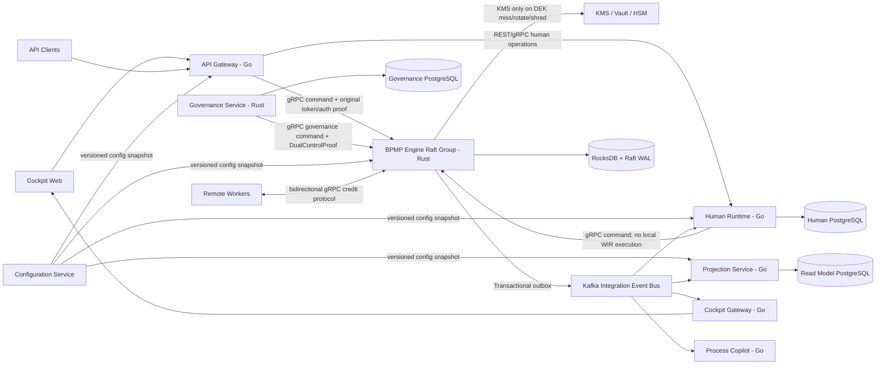

# BPMP Microservices Deployment Architecture

## 1. Mục tiêu và quyết định nền

Tài liệu này ánh xạ logical design trong `design.md` thành các deployable service. Kiến trúc backend là polyglot Rust/Go, nhưng có một ranh giới bắt buộc:

> `domain-core`, WIR interpreter, `decide()`, `evolve()` và authoritative workflow state chỉ tồn tại trong `bpmp-engine`, được viết bằng Rust. Không service Go nào được diễn giải WIR hoặc tự cài lại state-machine logic.

Port trong hexagonal architecture là ranh giới code bên trong process; port không mặc nhiên là một network service. Chỉ tách deployable service khi bounded context có ít nhất một trong các khác biệt rõ ràng về ownership, scaling profile, storage, security boundary hoặc release cadence.

## 2. Deployable services và quyền sở hữu

| Deployable | Language | Priority | Ownership | Storage | Không được sở hữu |
|---|---|---:|---|---|---|
| `bpmn-compiler` | Rust | P0 | Parse BPMN/DMN/CMMN, validate, sinh signed/versioned WIR artifact | Artifact registry/S3-compatible object storage | Runtime state, deployment orchestration |
| `bpmp-engine` | Rust | P0 | WIR loader, deterministic core, Stream Runtime, Event Store, Raft, Dispatcher, local WASM, authoritative authz/idempotency, Compensation Ledger và atomic governance transition | RocksDB trên từng Raft node; snapshot/backup ra object storage | Human task query model, AI inference |
| `authz-control-plane` | Rust | P0.5 | PostgreSQL-backed policy administration, lifecycle, signed bundle publication, rollback và audit quản trị | PostgreSQL riêng | Authoritative transition decisions hoặc runtime dependency trên critical path |
| `human-runtime` | Go | P1 | Work-item lifecycle, assignment/delegation, SLA/escalation, CMMN human view | PostgreSQL riêng | `decide()`/`evolve()`, workflow state authoritative |
| `api-gateway` | Go | P1 | Public REST API/BFF, coarse token validation, rate limit, request normalization, routing | Redis tùy chọn cho edge rate limit; không lưu workflow state | Authoritative transition authz/idempotency |
| `configuration-service` | Go | P1 | Versioned Configuration_Profile, schema validation, publish/rollback, audit cấu hình, API đọc cấu hình theo scope | PostgreSQL riêng hoặc GitOps/object storage adapter đã có versioning | Workflow decision logic, secrets/KMS key material, sửa trực tiếp cấu hình thuộc database service khác |
| `projection-service` | Go | P1 | Consume committed events, build Read Model, filter/query APIs, rebuild projection | PostgreSQL riêng; OpenSearch chỉ khi nhu cầu search được benchmark chứng minh | Command handling, write-side decisions |
| `governance-service` | Rust | P2, bắt buộc trước production PII | Retention policy, dual-control workflow, KMS coordination, legal deadline/escalation | PostgreSQL riêng cho policy/approval workflow | Ghi trực tiếp Event Store/Compensation Ledger hoặc tự shred trước engine commit |
| `cockpit-gateway` | Go | P3 | Fan-out SSE/WebSocket, subscription lifecycle, reconnect cursor | Không bắt buộc; Redis chỉ cho ephemeral presence nếu cần | Read Model authoritative, workflow decisions |
| `cockpit-web` | TypeScript | P3 | BPMN/CMMN/DMN editor, BA/Engineer views, operations UI | Static assets/CDN | Backend business logic |
| `process-copilot` | Go | P4 | LLM provider integration, telemetry aggregation, SLA prediction, draft generation | PostgreSQL/vector store riêng nếu thực sự cần | Write-side decisions hoặc tự động commit transition |
| Remote Workers | Rust, Go hoặc ngôn ngữ khác | Theo use case | Thực thi external service task qua worker protocol | Do worker owner quản lý | Workflow state và event log |

`governance-service` điều phối policy nhưng không sở hữu atomic data-governance commit. Nó gửi governance command kèm `DualControlProof` tới `bpmp-engine`; engine tái kiểm proof và ghi `TerminatedForCompliance`, Compensation Ledger, reconciliation work items và audit refs trong cùng Raft command/WriteBatch. Chỉ sau commit, governance mới được phối hợp revocation barrier và KMS shredding.

## 3. Runtime topology



Kafka là integration event feed, không phải authoritative event log. Kafka outage không được chặn command commit: engine giữ event trong outbox và publish lại theo sequence khi Kafka hồi phục.

Configuration Service không nằm trên critical path như một remote call bắt buộc cho từng command. Mỗi service giữ cache/read-through snapshot đã publish, có TTL và invalidation rõ ràng; khi xử lý command ghi event, engine gắn `config_version`/`policy_version` vào metadata để replay và audit dùng lại đúng quyết định lịch sử.

## 4. Các luồng quan trọng

### 4.1 Command thông thường

1. `api-gateway` xác thực sơ bộ token, rate limit và validate DTO.
2. Gateway chuyển original signed token hoặc short-lived signed auth context tới `bpmp-engine`.
3. Engine resolve tenant, tái kiểm authz tại graph transition, rồi mới kiểm idempotency key.
4. `domain-core.decide()` sinh event; Event Store append atomically qua local/Raft adapter.
5. Outbox publish committed integration event; downstream projection cập nhật bất đồng bộ.

Gateway không được là nơi duy nhất kiểm quyền hoặc lưu idempotency result cho state transition. Điều đó sẽ phá Requirement 7 và cho phép gateway retry/routing drift tạo double effect.

### 4.2 Human task

1. Engine commit `HumanTaskActivated` và publish qua outbox.
2. `human-runtime` consume idempotently, tạo work item trong PostgreSQL.
3. Khi actor complete/delegate, Human Runtime kiểm assignment/version cục bộ rồi forward original signed token hoặc short-lived signed actor context tới engine. Human Runtime không được dùng workload identity của chính service để đại diện quyền actor.
4. Engine thực hiện authoritative authz/decide/append.
5. Human Runtime chỉ chuyển work item sang trạng thái hoàn tất khi nhận committed event tương ứng; không dùng distributed transaction giữa PostgreSQL và RocksDB.

### 4.3 AbortAndReconcile

1. Governance tạo request digest từ tenant, policy, deadline, key epoch và pending-ledger digest.
2. Hai actor maker-checker ký approval; governance tái kiểm capability/fresh authentication.
3. Governance gửi command và `DualControlProof` tới engine.
4. Engine tái kiểm proof và commit atomic transition cùng reconciliation work items.
5. Sau committed event, governance chạy revocation barrier rồi mới gọi KMS shred key.

## 5. Hợp đồng liên service

- **Synchronous:** gRPC + Protocol Buffers. Rust dùng `tonic/prost`; Go dùng `grpc-go/protobuf-go`.
- **Public API:** REST/JSON qua `api-gateway`; OpenAPI được sinh từ source contract, không viết DTO độc lập bằng tay ở nhiều service.
- **Asynchronous:** Kafka event envelope có `event_id`, `tenant_id`, `stream_id`, `sequence`, `schema_version`, `correlation_id`, `occurred_at` và payload Protobuf.
- **Schema governance:** `buf lint`, `buf breaking` và generated-code drift check bắt buộc trong CI. Không tái sử dụng field number đã xóa; mọi breaking change phải tạo API/event version mới.
- **WIR artifact:** versioned Protobuf binary + manifest + SHA-256 + signature. WIR là opaque với service Go; chỉ compiler và engine đọc nội dung. Không dùng Rust memory layout hoặc `bincode` làm long-lived artifact contract.
- **Database ownership:** không service nào query trực tiếp database của service khác. Read need đi qua API hoặc committed event.
- **Configuration ownership:** cấu hình động được quản lý qua `configuration-service` hoặc store versioned thuộc đúng bounded context; service tiêu thụ cấu hình qua contract/cache snapshot, không hardcode policy trong code và không đọc trực tiếp bảng cấu hình của service khác.
- **Resilience:** gRPC deadline, bounded retry chỉ cho operation idempotent, exponential backoff + jitter, circuit breaker và bulkhead theo dependency.
- **Security:** mTLS service-to-service qua workload identity; workload identity chỉ xác thực service caller, không thay thế end-user actor. Tenant/actor context không lấy từ header do client tự khai báo nếu không có chữ ký; engine luôn tái kiểm actor authz trước idempotency lookup và transition.

## 6. Monorepo structure

```text
bpmp-platform/
|-- Cargo.toml                         # Rust workspace
|-- Cargo.lock
|-- rust-toolchain.toml
|-- go.work                            # Go workspace
|-- go.work.sum
|-- buf.yaml
|-- buf.gen.yaml
|-- Makefile                           # Thin developer entry points; logic phức tạp nằm trong tools/
|
|-- apps/
|   |-- rust/
|   |   |-- bpmn-compiler/
|   |   |-- bpmp-engine/
|   |   `-- governance-service/
|   |-- go/
|   |   |-- api-gateway/
|   |   |-- configuration-service/
|   |   |-- human-runtime/
|   |   |-- projection-service/
|   |   |-- cockpit-gateway/
|   |   `-- process-copilot/
|   `-- web/
|       `-- cockpit-web/
|
|-- crates/
|   |-- wir-model/                     # Rust-only canonical WIR types generated/validated from schema
|   |-- domain-core/                   # Pure; no Tokio, network, DB or wall clock
|   |-- application/                   # Command handlers and transaction boundaries
|   |-- ports/                         # In-process traits
|   |-- event-store/
|   |-- raft-state-machine/
|   |-- worker-protocol/
|   |-- wasm-runtime/
|   |-- governance-domain/
|   |-- adapter-rocksdb/
|   |-- adapter-openraft/
|   |-- adapter-keycloak/
|   |-- adapter-kms/
|   `-- observability-rs/
|
|-- go/
|   |-- authctx/                       # Verify signed internal auth context; no domain authz decisions
|   |-- eventconsumer/                 # Kafka envelope, dedup, checkpoint
|   |-- grpcmiddleware/
|   `-- observability/
|
|-- contracts/
|   |-- proto/
|   |   |-- bpmp/engine/v1/
|   |   |-- bpmp/human/v1/
|   |   |-- bpmp/governance/v1/
|   |   |-- bpmp/configuration/v1/
|   |   |-- bpmp/worker/v1/
|   |   `-- bpmp/events/v1/
|   |-- openapi/
|   `-- gen/                           # Generated Rust/Go; CI verifies clean regeneration
|
|-- db/
|   |-- configuration-service/migrations/
|   |-- human-runtime/migrations/
|   |-- governance-service/migrations/
|   `-- projection-service/migrations/
|
|-- tests/
|   |-- property/                      # P1-P53, chủ yếu Rust core
|   |-- contract/                      # Rust-Go gRPC/proto compatibility
|   |-- integration/
|   |-- chaos/
|   `-- performance/
|
|-- platform/
|   |-- helm/                          # Một chart/service; umbrella chart chỉ cho local/dev
|   |-- environments/                  # values overlays, không chứa secret
|   |-- policies/                      # NetworkPolicy, admission, OPA/Kyverno nếu dùng
|   |-- observability/
|   `-- local/                         # Docker Compose/Kind dependencies
|
|-- tools/                             # Codegen, xtask, CI scripts
|-- docs/adr/                          # Architecture Decision Records
`-- .github/workflows/                 # hoặc CI provider tương đương
```

Quy tắc dependency:

- `domain-core` không phụ thuộc Tokio, tonic, RocksDB, PostgreSQL, Kafka hoặc KMS SDK.
- Go packages không import/copy WIR logic. Chúng chỉ dùng generated Protobuf DTO.
- Adapter phụ thuộc port; port không phụ thuộc adapter.
- Shared package chỉ chứa technical plumbing hoặc contract-generated code, không chứa business logic dùng chung kiểu “misc/common”.

## 7. Production deployment

### 7.1 BPMP Engine

- Kubernetes `StatefulSet`, 3 node cho production thông thường; 5 node chỉ khi failure-domain/SLA thực sự yêu cầu.
- Persistent Volume/NVMe riêng cho từng pod; anti-affinity và topology spread qua zone.
- Headless Service cho Raft peer discovery; PodDisruptionBudget ngăn rollout làm mất quorum.
- Chỉ leader của một shard commit command; follower có thể chuyển tiếp tới leader.
- Scale bằng nhiều Raft group/shard theo `TenantId + StreamId`, không tăng vô hạn số node trong một Raft group.
- Dispatcher và local WASM nằm cùng process với engine. Không tách Dispatcher thành service riêng vì sẽ thêm network hop vào path `<10ms`/`P99 <5ms`.

### 7.2 Stateless services

- `api-gateway`, `human-runtime`, `projection-service`, `cockpit-gateway`, `process-copilot`: Kubernetes `Deployment`, HPA theo metric phù hợp.
- Cockpit Gateway scale theo active connection và outbound queue depth, có graceful drain cho SSE/WebSocket.
- Governance Service ở namespace/security boundary riêng; NetworkPolicy chỉ cho phép engine, Identity Provider và KMS endpoints cần thiết.
- PostgreSQL nên dùng managed service hoặc operator đã được tổ chức chuẩn hóa; mỗi bounded context có database/schema owner và credential riêng.
- North-south routing dùng Kubernetes Gateway API v1.5 (`Gateway`, `HTTPRoute`, `GRPCRoute`) với controller có conformance report và support matrix cho Kubernetes minor đang chạy. Không dùng community `ingress-nginx`, đã retired và không còn security fixes từ 03/2026. Controller implementation được pin theo environment ADR; không dựa vào annotation riêng nếu Gateway API đã có capability tương đương.

### 7.3 Supply-chain và vận hành

- Image non-root, read-only root filesystem, seccomp mặc định, drop Linux capabilities.
- Sinh SBOM, ký image/provenance bằng Sigstore/Cosign, scan CVE trước deploy.
- GitOps cho deployment; secret lấy từ KMS/Vault qua workload identity, không commit vào repository.
- Runtime policy/config không lưu bằng hardcode trong manifest hoặc source code. Helm values chỉ chứa bootstrap endpoint, cache TTL và reference tới Configuration_Profile đã publish; thay đổi policy vận hành đi qua schema validation, approval/audit và versioned rollback.
- OpenTelemetry Collector làm telemetry gateway; service phát OTLP trace/metric/log có `tenant_id` đã được policy cho phép và không chứa PII.

## 8. Tech baseline tại 2026-07-16

Version dưới đây là baseline khởi tạo, không phải lý do để tự động nâng mọi dependency lên newest trong production. Toolchain/container base được pin exact; library dependency được lock và nâng qua automated PR + test/benchmark/security gate.

| Layer | Baseline | Policy |
|---|---|---|
| Rust toolchain | Rust 1.96.1, Edition 2024 cho production; 1.97.0 chỉ ở candidate CI lane | Chỉ promote 1.97 sau compiler qualification hoặc patch 1.97.x được phê duyệt |
| Go toolchain | Go 1.26.5 | Pin trong `go.mod`/CI image |
| Rust async/RPC/HTTP | Tokio 1.52.x, tonic 0.14.x, axum stable compatible | Pin qua `Cargo.lock`; không để wildcard |
| WASM | Wasmtime 36.0.x LTS cho production; đánh giá 45.x ở benchmark branch | Ưu tiên LTS 24 tháng thay vì monthly release hỗ trợ ngắn |
| Consensus | openraft stable compatible với pinned Rust | Pin exact; model-check + chaos trước upgrade |
| Embedded event store | RocksDB production; `redb` chỉ là optional single-node profile sau benchmark | Loại `sled` vì beta/on-disk migration risk |
| Go PostgreSQL driver | `pgx/v5` | Pin module patch version |
| Relational DB | PostgreSQL 18.4 | Không dùng PostgreSQL 19 beta cho production |
| Identity | Keycloak 26.7.0 | Theo dõi security advisory; test step-up/fresh auth |
| Event integration | Apache Kafka 4.3.1, KRaft mode | Bugfix release hiện hành; không thay thế Raft/Event Store authoritative |
| Orchestration/edge | Kubernetes 1.36.2 + Gateway API v1.5 | Cấm ingress-nginx; controller phải conformant và support Kubernetes minor này |
| Observability | OpenTelemetry Collector 0.156.x | Chỉ dùng component có stability phù hợp production |
| API/schema | Protobuf + Buf; OpenAPI 3.1 | Breaking check bắt buộc |
| Frontend | TypeScript + React 19 + Vite; `bpmn-js`/`dmn-js` | Lockfile + browser E2E/visual tests |

### 8.1 Stack theo service

| Service | Runtime/framework | Data/messaging | Quality gates chính |
|---|---|---|---|
| `bpmn-compiler` | Rust, `quick-xml`, `prost`, `serde`, CLI `clap` | Signed WIR artifact trên S3-compatible storage | Golden files, round-trip, fuzz XML, P1-P2 |
| `bpmp-engine` | Rust, Tokio, tonic, rustls, Wasmtime LTS, openraft | RocksDB, Kafka outbox publisher, local DEK cache | proptest, loom cho concurrency cục bộ, stateright/TLA+, chaos, Criterion benchmark |
| `human-runtime` | Go, `net/http`, grpc-go, protobuf-go | PostgreSQL 18 qua pgx/v5; Kafka qua franz-go | race detector, integration Postgres, contract tests |
| `api-gateway` | Go, `net/http`, grpc-go, OIDC/JWKS middleware | Redis chỉ khi distributed rate limit cần thiết | fuzz DTO, authz negative tests, load test |
| `configuration-service` | Go, gRPC/REST admin API, protobuf schema validation | PostgreSQL hoặc GitOps/object storage adapter versioned | schema/range validation, audit/rollback tests, contract tests cho config snapshots |
| `projection-service` | Go, grpc-go | Kafka franz-go, PostgreSQL pgx/v5; OpenSearch optional | replay/rebuild determinism, checkpoint crash tests |
| `governance-service` | Rust, Tokio, tonic/axum, rustls | PostgreSQL qua sqlx, KMS/Vault SDK | P48-P52, dual-control contract, KMS failure/TOCTOU chaos |
| `cockpit-gateway` | Go, SSE + maintained WebSocket library | Kafka franz-go; Redis ephemeral optional | connection soak, slow-consumer/backpressure tests |
| `cockpit-web` | TypeScript, React 19, Vite, bpmn-js/dmn-js | REST + SSE/WebSocket | Playwright E2E, visual regression, accessibility |
| `process-copilot` | Go, grpc-go/HTTP clients | Read Model API; provider-specific model store optional | offline evaluation, prompt/schema contract, no-command test |

Không dùng ORM chung xuyên service. SQL migration thuộc đúng bounded context; query quan trọng được viết tường minh và kiểm execution plan/index theo Requirement 17.

Nguồn baseline chính thức:

- Rust releases: https://blog.rust-lang.org/releases/
- Go releases: https://go.dev/doc/devel/release
- Kubernetes releases: https://kubernetes.io/releases/
- Ingress-NGINX retirement: https://kubernetes.io/blog/2025/11/11/ingress-nginx-retirement/
- Gateway API v1.5: https://gateway-api.sigs.k8s.io/docs/implementations/versions/v1.5/
- PostgreSQL releases: https://www.postgresql.org/docs/release/
- Keycloak releases: https://www.keycloak.org/docs/latest/release_notes/
- Kafka downloads: https://kafka.apache.org/community/downloads/
- Wasmtime support policy: https://docs.wasmtime.dev/stability-release.html
- OpenTelemetry Collector: https://opentelemetry.io/docs/collector/

## 9. Delivery roadmap

| Phase | Deliverable | Exit criteria |
|---|---|---|
| P0 | `bpmn-compiler`, `bpmp-engine`, WIR schema, EventStore single-node, deterministic replay, local WASM | P1-P15 core properties; compiler-to-engine E2E; WAL benchmark |
| P0.5 | Tenant/key/version fields, encryption interfaces, authoritative idempotency/authz, outbox envelope | Log format frozen v1; no plaintext path; contract checks |
| P1 | `human-runtime`, `api-gateway`, minimal `projection-service`, `configuration-service`, remote worker protocol | Human task E2E, Rust-Go contract tests, versioned config validation/audit/rollback, load target cơ bản |
| P2 | Raft HA, production KMS, `governance-service`, retention/erasure/dual-control, full projection rebuild | P23, P46-P52; model checking; KMS/partition/approval chaos tests |
| P3 | Cockpit Gateway/Web, DLQ operations, production observability and SRE runbooks | Connection/load tests, replay operations, DR exercise |
| P4 | `process-copilot` | Không có quyền commit transition; evaluation metrics đạt threshold |

Không deploy production với dữ liệu PII thật trước khi P2 hoàn tất, dù P0/P1 đã đủ cho functional MVP trong môi trường dữ liệu giả lập.

## 10. Quyết định cần ghi ADR trước khi code

1. ADR-001: Rust-only deterministic core và cấm WIR interpretation ngoài engine.
2. ADR-002: RocksDB + Raft là authoritative event log; Kafka chỉ là integration feed.
3. ADR-003: Protobuf/Buf cho contracts và WIR artifact; không dùng `bincode` làm durable contract.
4. ADR-004: Database-per-bounded-context, không cross-service SQL.
5. ADR-005: Compensation Ledger được engine ghi atomically; governance chỉ orchestrate.
6. ADR-006: Production dependency upgrade policy ưu tiên supported/LTS, không chạy theo newest release một cách tự động.
7. ADR-007: Dynamic Configuration governance, versioned Configuration_Profile, scope override và danh mục giá trị tuyệt đối không được hardcode trong domain/application logic.
